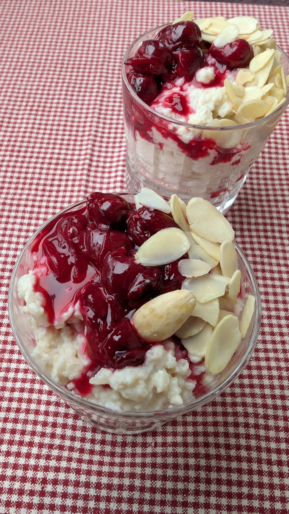

# Daniškas Kalėdų desertas: ryžių pudingas su vyšnių padažu

LABAS! Štai ir atėjo Gruodis. Ir štai jau trečius metus iš eilės gyvuoja mūsų tradicija paruošti jums Advento Kalendorių jaukiam ir skaniam Kalėdų laukimo laikotarpiui. :)

Šiemet kviečiu jus į 25 dienas trunkančią skonių kelionę po Pasaulį. Kasdien atversime naują langelį į skirtingų šalių Kalėdinę virtuvę ir susipažinsime su kitų tautų mėgstamais Kalėdų patiekalais ir jų švenčių tardicijomis. 

Tad šiandien užsukime į Daniją ir paskanaukime jų tradicinio Kalėdų deserto.

 Ryžių pudingas (*Risalamande*) - jau dešimtmečius yra danų mėgstamas Kalėdų patiekalas, kuris gyvuoja maždaug nuo 1900 metų, kai aukštuomenė per Kalėdas vietoje ryžių košės pradėjo serviruoti ryžių pudingą su vyšnių padažu. Jis ruošiamas su plakta grietinėle ir migdolų gabaliukais. Patiekiamas šaltas, kartu su karštu vyšnių padažu. O prieš patiekiant ryžių pudingą svečiams, viename iš desertų indelių paslepiamas vienas migdolas. Tas, kas jį randa, gauna papildomą dovanėlę, dažnai tai būna marcipaninis paršelis arba šokoladinė širdelė, ar net nedidelis stalo žaidimas. 

 Ryžių pudingas per Kalėdas valgomas skirtingai. Dalis šeimų jį ruošia dideliais kiekiais ir patiekia ant Kūčių stalo karštą, kaip pirmąjį patiekalą, o likučiai naudojami desertui ruošti. Kiti valgo tik kaip desertą.
 
 Tikima, kad ryžių košę mėgsta Kalėdų elfai (*nisse*), todėl vaikai dažnai palieka dubenėlį ryžių pudingo, kad įsitikinti elfų egzitavimu ir pelnytų jų palankumą. 

## Ryžių košei reikės

* 230 g Arborio ryžių (skirti Risotto ruošimui)
* 1 litro augalinio pieno
* Žiupsnelio druskos

## Ryžių pudingui reikės

* 100 g migdolų
* 400 ml riebaus kokosų pieno (21-24% riebumo, rinkitės kokosų pieną skardinėje; turi būti atšaldytas šaldytuve laikant per naktį)
* 2 v. š. cukraus pudros
* 1 a. š. vanilės pastos
* Migdolų riekelių (papuošimui)

## Vyšnių padažui reikės

* 320 g šaldytų vyšnių
* 120 ml vandens
* 3 v. š. cukraus
* 2 a. š. kukurūzų krakomolo
* ~2 a. š. šviežiai spaustų citrinos sulčių 
  
## Paruošimas

1. Pasiruošiame ryžių košę (galima virti iš vakaro, kadangi deserto ruošimui naudojama pilnai atvėsusi košė). Į puodą pilame augalinį pieną, suberiame išplautus ryžius ir įdedame žiupsnelį druskos. Kaitiname ant vidutinės kaitros, vis pamaišant, kol užverda. Tuomet šiek tiek sumažinama kaitra ir švelniai verdame, vis maišant, kol išverda ryžiai ir košė sutirštėja, apie 30-40 min. Atvėsiname ir laikome šaldytuve iki deserto ruošimo.
2. Migdolus nuplauname ir užpilame užvirintu, karštu vandeniu. Palaikome bent 10 min. Tuomet nupilame vandenį ir nuo migdolų nuimame luobeles. Visus migdolus išskyrus vieną, didžiausią ir gražiausią (kurį slėpsime deserte), susmulkiname į gabaliukus.
3. Atšaldytą kokosų pieno skardinę atidarome ir išimame į indą tik baltą, riebią kokosų pieno dalį (kokosų vanduo nebus naudojamas). Kokosų pieną suplakame su 2 v. š. cukraus pudros. 
4. Atvėsintą ryžių košę maišome su suplaktu kokosų pienu, įmaišome vanilės pastos ir migdolų gabaliukus.
5. Ruošiame vyšnių padažą. Į nedidelį puodą pilame vandens, sudedame šaldytas vyšnias ir cukrų. Kaitiname, kol užverda. Nedideliame indelyje ištirpiname krakmolą citrinos sultyse ir šį mišinį supilame į puodą su verdančiomis vyšniomis. Šiek tiek pamažiname kaitrą ir švelniai paverdame, kol padažas šiek tiek sutirštėja, ~5 min.
6. Patiekimui į desertines ar stiklines dedame šalto ryžių pudingo ir užpilame karštu vyšnių padažu, puošiame pabarstant migdolų riekelėmis. 
7. Vienoje iš stiklinių paslėpkite migdolą.

Tikimės, kad pirmoji kelionė į Daniją patiko ir sudomino paragauti jų tradicinį patiekalą. 
Būsime labai dėkingi, jei pasidalinsite žinia apie Advento Kalendorių su draugais ir pažįstamais, arba paremsite mūsų veiklą mūsų Ko-Fi puslapyje. Ačiū labai ir iki rytojaus!

Skanaus ir jaukaus švenčių laukimo! :)

