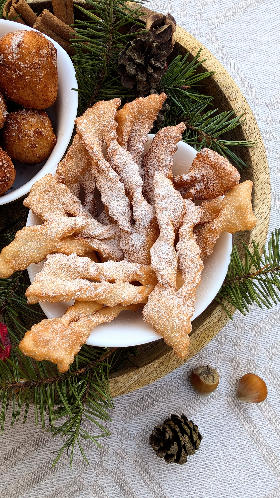

# Žagarėliai

Be galo džiugu matyti jus, prisijungusius prie šv. Kalėdų laukimo. :)

Tikimės, kad šis Advento Kalendorius lydės jus iki pat Kalėdų skleisdamas pakylėtą švenčių laukimo nuotaiką, padės atrasti naujų receptų jaukiems Gruodžio vakarams ir lengviau pasiruošti šventinius stalus pilnus maistingų ir skanių patiekalų, nepristingant įkvėpimo ir idėjų. :)

Kiekvienos dienos naujai atsivertusiame langelyje rasite augalinį receptą arba specialiai jums paruoštą dovaną, o Kalėdiniame vainike - filmo rekomendaciją (paspauskite ant vainiko ir pasižiūrėkite rekomenduojamo filmo trailerį).

Taigi, nieko nelaukdami, Kalėdų laukimą pradėkime su naminiais, nostalgiškais žagarėliais. 

Kvepiantys vanile ir gausiai pabarstyti cukraus pudra. Ar gali būti jaukiau? :)

## Jums reikės

* 450 g kvietinių miltų
* 100 g cukraus
* 65 g augalinio sviesto
* 100 g obuolių tyrės
* 3 v.š. augalinio, natūralaus skonio, sojos jogurto
* 1,5 a.š. vanilinio cukraus arba vanilės pastos
* Žiupsnelis druskos
* Cukraus pudros

## Paruošimas

1. Ištirpiname augalinį sviestą ir suberiame į jį cukrų. Maišydami kaitiname, kol cukrus ištirpsta. Paliekame šiek tiek atvėsti.
2. Į indą sudedame miltus, supilame tirpintą sviestą su cukrumi, dedame obuolių tyrės ir augalinio jogurto. Įdedame vanilės ir druskos. Pradedame maišyti tešlą šauktu ir toliau minkome rankomis (jei tešla gautųsi skystoka kočiojimui, rekomenduojama palaikyti ją šaldytuve apie pusvalandį).
3. Kočiojame tešlą. Iškočiotą ploną tešlos lakštą pjaustome juostelėmis su banguotu peiliuku. Juosteles jų viduryje įpjauname ir perneriame juosteles per jos viduje esantį įpjovimą. 
4. Žagarėlius verdame įkaitintame aliejuje apverčiant, kad apkeptų abi žagarėlio pusės. Iškeptus žagarėlius dedame ant vienkartinio virtuvinio popieriaus, kad šiek tiek susigertų perteklinis aliejus. 
5. Žagarėliams šiek tiek atvėsus juos gausiai barstome cukraus pudra ir skanaujame su jūsų mėgstamiausiu karštu gėrimu. 

Skanaus šventinio laukimo 😊

