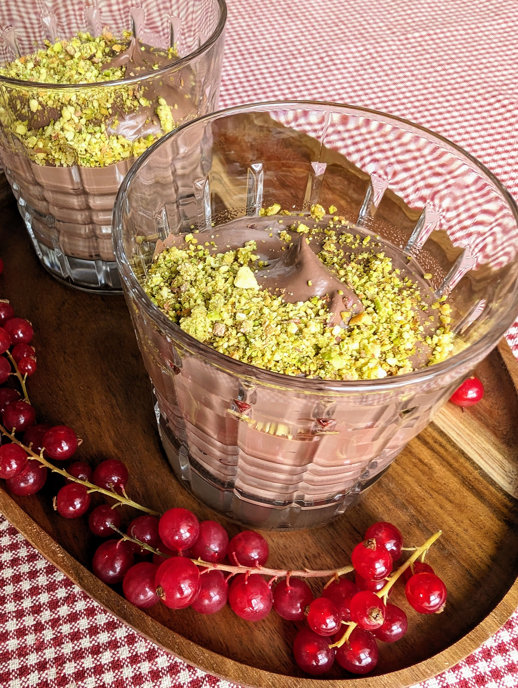

# Šokoladinis tofu desertas

Labai šokoladinis, lengvai ir greitai, vos per keletą minučių, paruošiamas desertas, kurio paruošimui reikės tik poros ingredientų. Kodėl gi nepasilepinus?

## Jums reikės

* 350 g Silken tofu (šilkinio tofu)
* 200 g juodojo šokolado
* Pistacijų (papuošimui)
* Raudonųjų serbentų (nebūtina, papuošimui)

## Paruošimas

1. Ištirpiname juodąjį šokoladą.
2. Inde su virtuviniu mikseriu iki vientisos kreminės tekstūros sutriname šilkinį tofu kartu su juoduoju šokoladu. 
3. Valgyti galima iškarto, kambario temperatūros arba galima atvėsinti šaldytuve (laikant šaldytuve šiek tiek keičiasi tekstūra, į standesnę, tuo tarpu valgant kambario temperatūros desertas jaučiasi labiau kaip purus kremas ar pudingas).
4. Pistacijas sutriname virtuviniu mikseriu iki smulkių gabalėlių ir pabarstome jų pavišiuje. Patiekiame papuoštus raudonaisiais serbentais, kurie ne tik puošia, bet ir labai tinka valgyti kartu.

P.S. Nepamirškite, kad paspaudus ant vainiko su filmo rekomendacija galite pasižiūrėti rekomenduojamo filmo trailer'į. 😊 

Skanaus šventinio laukimo!

