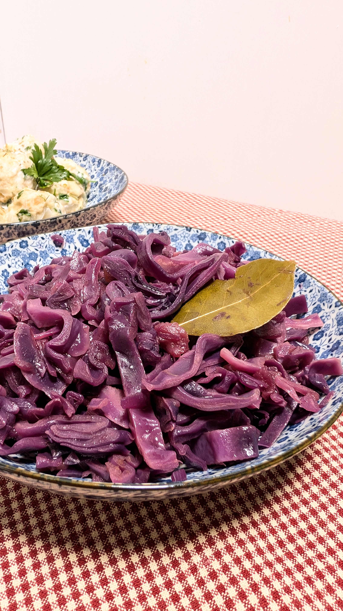

# Troškinti raudonieji kopūstai (Vokietija) 

Pastaruoju metu pradėjo populiarėti įvairūs maisto tematikos, stikliniai, eglutės žaisliukai. Jau per daug nenustebtume ant eglutės pamatę pakabintą baklažaną, brokolį ar net agurkėlį. Bet ar teko girdėti apie vokiško agurkėlio (*German Christmas Pickle*) tradiciją? Juokingiausia dalis turbūt ta, kad apie *vokišką agurkėlį* mažai, kas Vokietijoje girdėjo ir dar mažiau vokiečių šios tradicijos laikosi (Vienos apklausos metu įvertinta, kad šią tradiciją girdėjo tik apie 8% vokiečių ir tik apie 2% jos laikosi). 

*German Christmas Pickle* arba kartais tiesiog *Christmas Pickle*, galite sutikti Amerikoje. Ant eglutės, dažnai šiek tiek nuošaliau paslepiamas agurkėlio formos stiklinis eglutės žaisliukas. Pirmas jį radęs - gauna papildomą dovaną arba gali pirmas išpakuoti dovanas. 

Šios tradicijos tikroji kilmė nėra žinoma ir yra sukurta ne viena istorijos versija. Bet viena jų ir ganėtinai tikėtina yra tiesiog... - paprastas, bet kūrybiškas marketingas. Amerikoje pradėjus pardavinėti vokiškus, maisto tematikos žaisliukus Kalėdų eglutėms, agurkėliai buvo mažiausiai perkami, todėl, manoma, kad buvo išgalvota istorija apie "seną vokiečių tradiciją" kabinti tokį žaisliuką ant eglučių ir apdovanoti pirmąjį jį radusį žmogų. Ir nors versijų prikurta ne viena ir nei viena turbūt neturi įrodymų apie jos tikrumą, pati keisčiausia ir kraupiausia iš sklandančių yra legenda apie užeigoje apsistojusius ispanų (net ne vokiečių) berniukus, kuriuos nužudė užeigos savininkas ir paslėpė kūnus marinuotų agurkų statinėje. Apsilankęs užeigoje Šv. Nikolas juos rado ir grąžino iš numirusių. "Labai šventiška" istorija, tikras Kalėdų stebuklas, tiesa..? (Brr...) 

Dabar per Kalėdas galėsite ne tik įtraukti naujų žaidimų (ieškoti agurkėlio ant eglutės), bet ir turėsite keistų ir nejaukių istorijų pasidalinimui prie šventinio stalo. Nedėkokit... :D

Na, o dabar grįžtam prie tikrų ir neišgalvotų vokiškų Kalėdų tradicijų. :) Tradicinis vokiečių Kalėdų stalas nebūtų pilnai išpildytas, jei ant jo nebūtų garnyrui patiekta troškintų raudonųjų kopūstų, kurie ruošiami su žiemos sezono klasikiniais prieskoniais: gvazdikėliais ir cinamonu. Ir nors tai laikoma tradiciniu Kalėdų patiekalu, visgi jis itin mėgstamas Vokietijoje, tad daugelio vietinių yra valgomas visus metus, nepriklausomai nuo metų sezono. 

## Jums reikės

* 700 g raudonojo kopūsto (~ pusė vidutinio dydžio kopūsto)
* 1 vnt. svogūno
* 1,5 vnt. obuolių
* 2 v. š. rapsų aliejaus
* 30 ml raudonojo vyno acto
* 70 ml vandens
* 1 v. š. cukraus
* 0,5 a. š. cinamono 
* 0,5 a. š. druskos
* Lauro lapelio
* 2 vnt. gvazdikėlių

## Paruošimas

1. Nuplauname ir supjaustome juostelėmis raudonąjį kopūstą. Pjaustytą kopūstą užpilame raudonojo vyno actu ir išmaišome šaukštu.
2. Nuskutame obuolius ir supjaustome kubeliais.
3. Supjaustome kubeliais svogūną ir dedame kepti į puodą su aliejumi. Šiek tiek jam apkepus įdedame cukraus ir supjaustytus obuolius. Apkepame maišant kol lengvai karamelizuojasi. Sudedame kopūstus ir keletą minučių pakepame maišant, kol šiek tiek suminkštėja.
4. Pilame vandenį, dedame druskos, cinamono, įdedame lauro lapelį ir gvazdikėlius (juos rekomenduojama dėti arbatos sietelyje). Kopūstus troškiname apie valandą vis pamaišant.
5. Išimame sietelį su gvazdikėliais. Patiekiame kopūstus karštus. Galima papuošti lauro lapeliu.

Skanaus šventinio laukimo!

