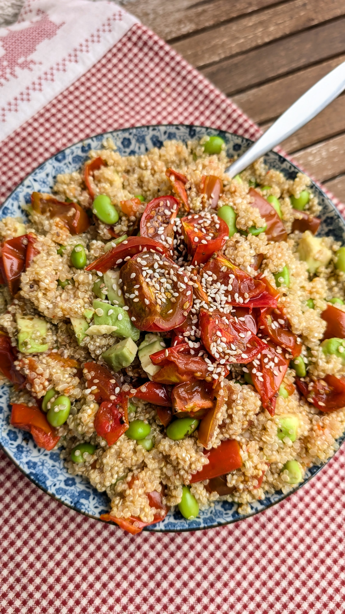

# Karštos bolivinės balandos salotos su orkaitėje keptais pomidorais 

Šios spalvingos ir maistingos salotos puikiai tiks tiek vakarienei vėsų žiemos vakarą, tiek kaip garnyras pietų metu, tačiau jos tikrai vertos būti ir ant šventinio Kalėdų stalo!

Pakepinti pomidoriukus orkaitėje neužtruks ilgai, tačiau tai tikrai salotoms suteikia išskirtinį skonį. Keptų pomidorų sultys kartu su sezamų ar alyvuogių aliejumi susilies į aromatingą padažą jūsų salotoms, o ir pomidorų skonis, juos iškepus orkaitėje, išryškės ir atsiskleis visiškai naujai.

## Jums reikės

* 250 g bolivinės balandos
* 150 g šaldytų edamame pupelių
* 400 g slyvinių pomidorų 
* 1 prinokusio avokado
* Žiupsnelio druskos ir pipirų 
* Sezamų arba alyvuogių aliejaus
* Raudonėlių
* Sezamų

## Paruošimas

1. Pomidoriukus supjaustome griežinėliais, sudedame į kepimo indą, apšlakstome alyvuogių arba sezamų aliejumi, pabarstome druska ir pipirais. Kepame iki 180°C įkaitintoje orkaitėje apie 15 min, kol pomidoriukai šiek tiek apkepa.
2. Kol orkaitėje kepa pomidorai, pasūdytame vandenyje išverdame bolivinę balandą. Bolivinei balandai baigiant virti, į tą patį puodą sudedame atitirpintas edamame ir paliekame uždengtame puode šiek tiek pasitroškinti ir sušilti, maždaug 2-3 min.
3. Gerai prinokusį avokadą supjaustome kubeliais.
4. Bolivines balandas su edamame perkeliame į dubenį, sudedame avokadus ir ant viršaus suverčiame keptus pomidorus, kartu su kepimo inde esančiu aliejumi ir pomidorų sultimis (galima keletą keptų pomidoriukų pasilikti papuošimui, kuriuos sudėsite ant jau paruoštų salotų paviršiaus). Pabarstome raudonėlio, viską išmaišome ir ant viršaus pabarstome sezamo sėklų. 
5. Salotas patiekiame dar šiltas.

Skanaus šventinio laukimo!

