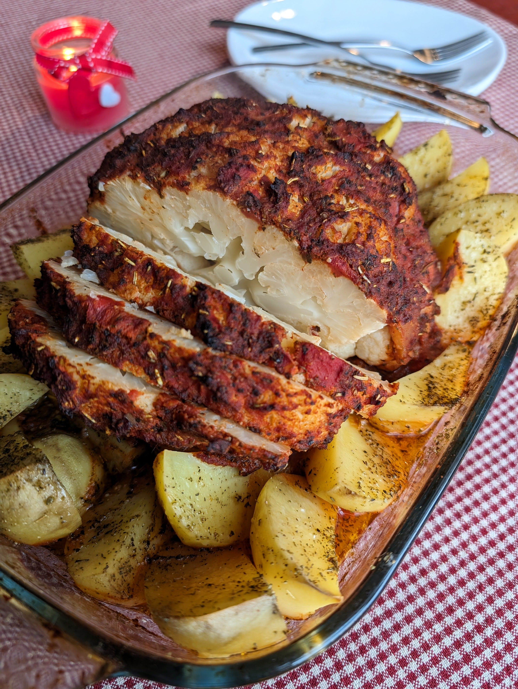

# Orkaitėje keptas žiedinis kopūstas

Orkaitėje keptas žiedinis kopūstas su prieskoningu padažu puikiai pakeis kepsnį į augalinę, sveikesnę alternatyvą ir be jokios abejonės atkreips visų svečių dėmesį. Aromatingas, ryškaus skonio padažas ir švelnus, minkštas viduje žiedinis kopūstas sukuria darnią skonių harmoniją. Ir pripažinkim, atrodo šis patiekalas tikrai įspūdingai. :)

## Jums reikės

* Vieno didelio žiedinio kopūsto
* 1 skardinės pjaustytų pomidorų gabalėlių savo sultyse (400 g)
* 3 v.š. alyvuogių aliejaus
* 1 v.š. rūkytos paprikos
* 2 a.š. česnako granulių
* 1 a.š. kumino 
* 1 a.š. baziliko
* 1 a.š. raudonėlio
* 1 a.š. rozmarino
* 1 a.š. krapų
* Žiupsnelis juodųjų pipirų

* Rekomenduojame kartu orkaitėje išsikepti ir bulvių skilteles. 

## Paruošimas

1. Pasiruošiame žiedinį kopūstą: švariai nuplauname, nupjauname lapus ir patrumpiname kotelį. 
2. Žiedinį kopūstą paverdame sūdytame vandenyje 10 min, dangčiu uždengtame puode (vanduo gali neapsemti viso žiedinio kopūsto). Kopūstui apvirus, nupilame vandenį. 
3. Pasiruošiame padažą: sumaišome pjaustytus pomidorus su jų sultimis kartu su prieskoniais ir alyvuogių aliejumi. 
4. Žiedinį kopūstą dedame į orkaitėje kepti pritaikytą indą ir ištepame žiedinio kopūsto paviršių paruoštu padažu. 
5. Žiedinį kopūstą kepame 180C temperatūroje apie 45 min. Patikriname dantų krapštuku ar žiedinis kopūstas minkštas, jei reikia pakepame dar 10 min. 
6. Kartu su žiediniu kopūstu rekomenduojame orkaitėje išsikepti ir bulvių skilteles apšlakstytas aliejumi su juodaisiais pipirais, druska ir žoliniais itališkais prieskoniais. Bulvės orkaitėje įprastai kepa apie 60 min (galima tiek pat laiko kepti ir žiedinį kopūstą, tik gausis šiek tiek minkštesnis).

P.S. Nepamirškite, kad paspaudus ant vainiko su filmo rekomendacija galite pasižiūrėti rekomenduojamo filmo trailer'į. 😊 

Skanaus šventinio laukimo!

