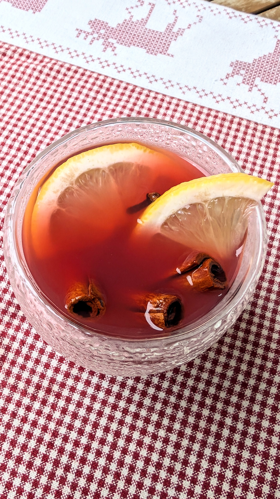

# Kalėdinis punčas vaikams (Vokietija)

Viena iš gražiausių Vokietijos Advento tradicijų - Kalėdinės mugės, čia žinomos kaip *Weihnachtsmärkte*. Jos mėgstamos tiek vietinių, tiek turistų, atvykstančių pasimėgauti Kalėdinio laikotarpio magija ir atmosfera. Kalėdinių mugių tradicija gyvuoja nuo 15 amžiaus, o šiuo metu suskaičiuojama daugiau nei 2,500 mugių visoje Vokietijoje. Čia skamba Kalėdinė muzika ir aplinka kvepia sezoniniais gėrimais, o susižavėjusios akys paklysta tarp dailių suvenyrų, rankdarbių ir šventinių skanėstų.

Vokietijos Kalėdų mugėse galima paskanauti karšto, jaukaus ir aromatingo gėrimo *Kinderpunsch*, kuris verčiasi kaip punčas vaikams, tačiau skirtas tikrai ne tik mažiesiems. Tai puikus gėrimas ir suaugusiems, kuriems norisi atmosferiško ir sušildančio gėrimo be alkoholio. Arbata, sultys ir keletas Kalėdinių prieskonių, tai viskas, ko prireiks aromatingam ir atmosferiškam gėrimui paruošti, kurį galėsite skanauti kartu su visa šeima. 

## Jums reikės

* 2 Kinrožių arbatos maišeliai (jei neturite, galima keisti kita vaisine arbata)
* 2 puodeliai vandens
* 1 puodelis obuolių sulčių
* 0,5 puodelio apelsinų sulčių
* 2 vnt. cinamono lazdelių
* ~6 vnt. gvazdikėlių
* 2 citrinos griežinėlių
* Pasaldinimui galima įpilti pagal skonį klevų sirupo ar įdėti šiek tiek cukraus
* Žvaigždinis anyžius, cinamono lazdelės, apelsinų ir citrinų griežinėliai (papuošimui, nebūtina)
  
## Paruošimas

1. Nedideliame puode užviriname du puodelisu vandens. Nuimame nuo kaitros ir sudedame du maišelius arbatos, cinamono lazdeles, gvazdikėlius (juos rekomenduojame merkti arbatos sietelyje, kad būtų lengviau paskui išimti) ir citrinos griežinėlius. Palaikome apie 5-8 min. (nekaitinant!). 
2. Išimame arbatos maišelius. Supilame sultis ir grąžiname puodą ant kaitlentės.Šiek tiek pašildome, bet neužverdame.
3. Palaikome dar apie 8-10 min., kad spėtų atsiskleisti visi prieskonių aromatai. 
4. Išimame sietelį su gvazdikėliais ir išpilstome gėrimą į puodelius ar karščiui atsparias stiklines. Jei norima, galima papuošti gėrimus įdedant citrinos ar apelsinų griežinėlius, cinamono lazdelę ar žvaigždinio anyžiaus.

Skanaus ir jaukaus šventinio laukimo. :)

P.S. Primename, kad paspaudus ant "Džiaugsmo kalendoriaus" lapelio, esančio po receptu, atsivers užduotis dienai, kuri suteiks džiaugsmo ne tik jums, bet ir kitiems. O kai džiaugsmu daliniesi, jis dvigubėja!
