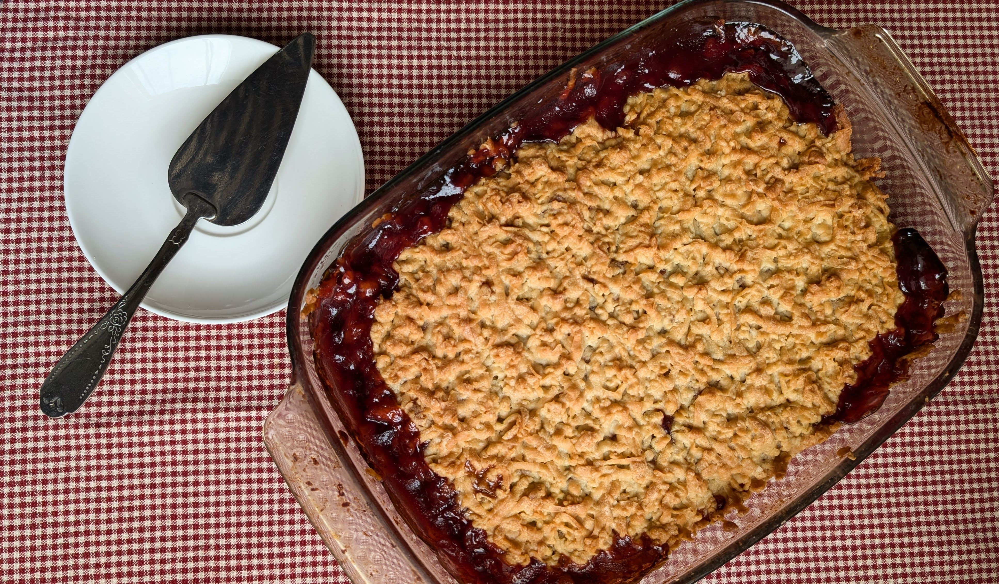

# Trupininis pyragas su bruknių uogiene

Namuose keptas trupininis pyragas bene vienas nostalgiškiausių, vaikystę primenančių desertų. 

Man jis skaniausias su švelnios rūgštelės turinčiomis uogienėmis - bruknių, juodųjų serbentų ar spanguolių. 

Pasilepinkim. Pakvieskim draugus ir šeimos narius susitikti prie puodelio kavos kartu su gabalėliu naminio pyrago. Tegul namai prisipildo saldžių kepinių kvapais ir jaukumu, o aplinkoje netyla šilti pokalbiai ir juokas. :)

## Jums reikės

* 550 g kvietinių miltų
* 200 g augalinio pieno
* 200 g augalinio sviesto
* 0,5 puodelio cukraus (~100 g)
* 2 a.š. kepimo miltelių
* 1 a.š. vanilinio cukraus ar vanilės ekstrakto
* ~500 g bruknių uogienės
* Cukraus pudros (pyragui pabarstyti; nebūtina)
  
## Paruošimas

1. Ištirpiname augalinį sviestą.
2. Į tirpintą sviestą supilame augalinį pieną ir cukrų. Trumpai kaitiname ir maišome, kol cukrus ištirpsta. Mišiniui neleidžiame užvirti.
3. Į indą sudedame miltus ir kepimo miltelius, išmaišome. Pilame ištirpintą sviestą su augaliniu pienu ir cukrumi. Įdedame vanilinio cukraus arba vanilės ekstrakto.
4. Gerai išminkome tešlą ir padaliname į dvi dalis (iš tešlos suformuojame du rutulius, kad vėliau būtų patogu išimti ir tarkuoti). Dedame tešlą į šaldiklį šaldyti per naktį.
5. Kepimo indą ištepame aliejumi.
6. Tarkuojame tešlą, trupinius tolygiai paskirstant ant kepimo formos pagrindo.
7. Ant trupinių tolygiai paskirstome uogienės sluoksnį ir ant viršaus tarkuojame tešlos trupinius.
8. Kepame orkaitėje 180°C temperatūroje apie valandą, kol gražiai apskrunda (kepimo laikas priklausys nuo naudojamo kepimo indo dydžio ir gylio, bei jūsų naudojamos orkaitės kaitrumo). 😊
9. Pyragui atvėsus, pabarstome cukraus pudra.

Skanaus šventinio laukimo. :)

P.S. Primename, kad paspaudus ant vainiko su dienos filmo rekomendacija galite pasižiūrėti rekomenduojamo filmo trailer'į.

