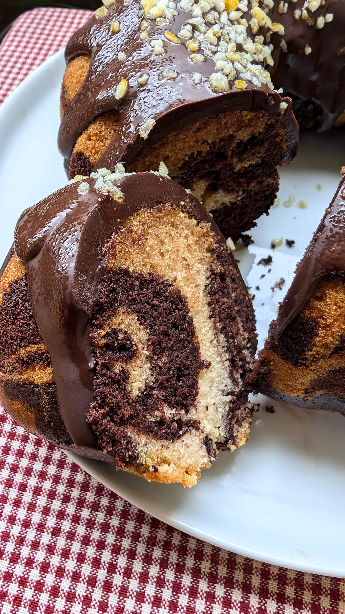

# Marmurinis pyragas (Vokietija ir kitos šalys)

 Marmurinis pyragas yra tobulas desertas tiek Kalėdoms, tiek Naujųjų metų išvakarėms. Lengvai paruošiamas ir tikrai įspūdingas: žavingi, marmurą primenantys raštai, daili forma ir aplietas gausiu šokolado sluoksniu paviršiuje. 
 
 Šį receptą sunku priskirti vienai šaliai, kadangi jo populiarumas yra Pasaulinis. Visgi, panašu, kad pati marmurinio pyrago (vokiškai *Marmorkuchen*) idėja gimė XIX amžiuje Vokietijoje. O pirmoji versija buvo visai ne biskvitas, o saldus, mielinis pyragas, kurio marmurinis raštas buvo išgaunamas su melasa ir prieskoniais. Dabar populiariausias receptas yra vanilinis biskvitas permaišytas su šokoladiniu, tačiau tai tikrai ne vienintelė šio pyrago versija. Rasite ir marmurinį kavos pyragą, ir braškinį ar kitų vaisių, o skirtingų versijų pyraguose naujų skonių sukuriama įmaišius cinamono, romo ar citrinų žievelės.

 Ir nors Marmurinis pyragas nėra išskirtinai simbolinis Kalėdų desertas, visgi jis tikrai dažnas pasirinkimas šventėms įvairiausiose šalyse dėl jam būdingo paprasto paruošimo, puikaus skonio, jo dailumo, nereikalaujant jokių išskirtinių dekoravimo gebėjimų, ir nostalgijos vaikystės prisiminimams (tokius dažnai kepa mamos, močiutės,o vaikai dažniau vadina jį ne marmuriniu pyragu, o *Zebriuku*).

 Marmurinis pyragas sutinkamas ne tik Vokietijoje, bet ir Austrijoje (ir ne tik austrų namuose, bet parduodamas ir kepyklėlėse, restoranuose). Lenkijoje marmurinio stiliaus pyragas - *Babka* (įprastai vanilinis su šokoladu), dažniau sutinkamas per Velykas, visgi pasitaiko ir ant Kalėdų stalo. O *Bolo mármore* Brazilijoje ir Portugalijoje mėgstamas visus metus. 

## Jums reikės

* 385 g kvietinių miltų
* 225 g cukraus
* 1 šaukšto kepimo miltelių
* 140 g rapsų aliejaus
* 400 g augalinio pieno
* 1 arbatinio šaukštelio sodos
* 1 šaukšto vanilės ekstrakto
* ~1 šaukšto obuolių acto
* 0,5 arbatinio šaukštelio druskos
* 155 g obuolių tyrės
* 50 g kakavos
* Papuošimui: dvi šokolado plytelės, riešutai ar pabarstukai

## Paruošimas

1. Sudedame į indą miltus, cukrų, kepimo miltelius, druską. Išmaišome šaukštu. Įdedame šaukštelį sodos ir užpilame šaukštu acto.
2. Įpilame augalinį pieną, vanilės ekstraktą, aliejų. Įdedame obuolių tyrės.
3. Viską gerai išmaišome virtuviniu mikseriu.
4. Pusę tešlos perpilame į kitą indą ir įdedame kakavos. Išmaišome.
5. Į likusią vanilinę tešlą pagal poreikį galima įdėti 1-2 v. š. miltų, kad konsistencija būtų panašesnė į tešlos su kakava (įprastai vanilinė tešla būna skystesnė lyginant su kita tešlos dalimi, kurią maišome su kakava).
6. Kepimo formą ištepame aliejumi ir pilame tešlą sluoksniais. Įpilame samtį šviesios tešlos, ant viršaus pilame samtį tešlos su kakava, vėl šviesios tešlos, ir vėl su kakava. Kartais vis galima pamaišyti tešlas tarpusavyje su šaukšto galu piešiant ornamentus.
7. Dedame kepti pyragą į iki 180°C įkaitintą orkaitę 40-60 minučių. Kepimo laikas priklausys nuo kepimo formos dydžio. Ar pyragas iškepęs tikriname su mediniu dantų krapštuku. Jei ištraukus krapštuką jis yra sausas - keksas iškepęs, jei aplipęs tešla - reikia kepti ilgiau.
8. Pyragą puošiame lydytu, juoduoju šokoladu, riešutais, galima pabarstyti pabarstukais ar kokosų drožlėmis. 

Skanaus!