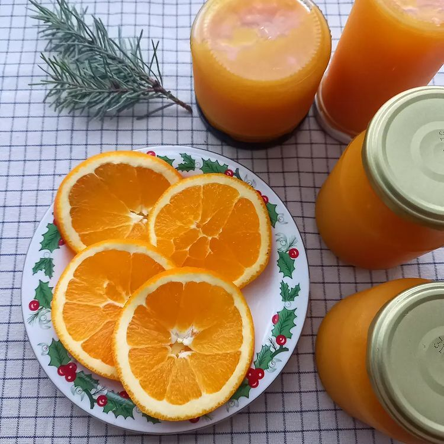

# Apelsinų uogienė

Paruošiama visai nesudėtingai. Aromatinga ir išskirtinio skonio. Puiki idėja ir rankų darbo dovanai. 😊

## Jums reikės

* 2700 g apelsinų su žievelėmis, arba 1900&nbsp;g be žievelių. 
* ~250 g vandens 
* 400 g cukraus 

## Paruošimas

1. Nulupame apelsinus, padaliname skiltelėmis ir išimame kauliukus. Kauliukai skiltelėse gerai matosi laikant skiltelę priešais šviesą.
2. Dedame apelsinus į puodą, beriame cukrų ir įpilame vandens.
3. Verdame vis pamaišant.
4. Su virtuviniu trintuvu sutriname apelsinus iki vientisos masės. Verdame toliau, kol sutirštės.
5. Išpilstome karštą apelsinų uogienę į švarius stiklainius, sandariai užsukame ir pastatome apverstus ant dangtelių. 
6. Uogienei atvėsus dedame uogienę į šaldytuvą.

Skanaus šventinio laukimo!

