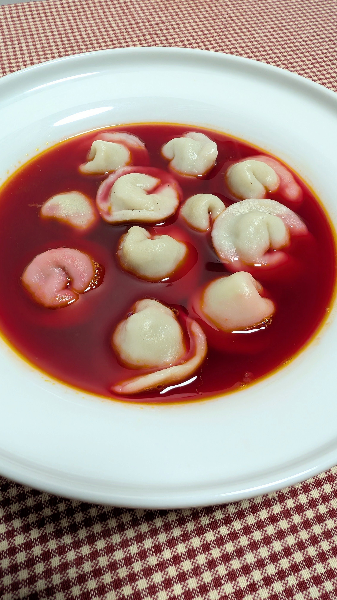

# Kalėdiniai barščiai su grybų koldūnais (Lenkija) 

Lenkijoje Kūčių vakarienė yra svarbiausia šventė metuose. Ir nors ši vakarienė skirta artimiausių žmonių, šeimos susibūrimui, yra įprasta ant stalo paserviruoti viena lėkšte daugiau ir pastatyti prie stalo papildomą kėdę skirtą netikėtam svečiui. Daugelis Kūčioms gaminamų patiekalų yra išskirtiniai, simboliniai būtent šiam vakarui ir gaminami tik kartą per metus. 

Kūčių (*Wigilia*) vakarienė prasideda vakare, kai danguje suspindi pirmoji žvaigždė. Valgyti pradedama tik tada, kai visi prie stalo sėdintys žmonės atsilaužia ir suvalgo plotkelę (*opłatek*) bei palinki vieni kitiems sveikatos ir klestėjimo. Vakarienės metu įprasta, kad ant stalo būtų 12 patiekalų (simbolizuoja 12 Apaštalų ir 12 mėnesių metuose), o kiekvienas svečias pagal tradiciją turėtų paragauti visko po truputį. Ant Kūčių stalo nebūna mėsos, tačiau valgomi žuvies patiekalai. Kartu su maistu įprastai patiekiamas džiovintų vaisių kompotas, o desertui kepamas aguonų pyragas - *Makoviec*. Po Kūčių vakarienės visi keičiasi dovanomis.

Kūčių vakarienė įprastai prasideda su tradicine, skaidria barščių sriuba su grybų koldūnais (Lenkijoje vadinamais *uszka*, kas reiškia "mažos ausytės"). Tradicinės sriubos paruošimas reikalauja net keleto dienų, kadangi jai paruošti įprastai gaminamas *zakwas* iš šviežių, tarkuotų burokų, kurie fermentuojami namuose apie 4-5 dienas. 

Skaidri ir ryškiai raudona sriuba atrodo įspūdingai, šventiškai ir labai Kalėdiškai, lyg iš Kalėdų senelio meniu. Dalinamės mūsų šiek tiek supaprastintu lenkiškų Kalėdinių barščių receptu, kurį galima įgyvendinti kartu su naminiais koldūnais per keletą valandų. Tradiciškai koldūnai Lenkijoje gaminami su miško grybais, tačiau mūsų recepte - pievagrybiai. Skonis labai geras, rekomenduojam išbandyti. :)

## Barščiams reikės

* 850 g marinuotų burokėlių (pilame į sriubą su sultimis/marinatu)
* 2 vnt. vidutinio dydžio morkų
* 0,5 vnt. žalio obuolio
* 1 vnt. didelio svogūno
* 1 vnt. gvazdikėlių
* 2 vnt. Lauro lapelių
* 3 vnt. česnako skiltelių
* 2 vnt. juodųjų pipirų (netrintų)
* 3 vnt. kvapiųjų pipirų (netrintų)
* 1200 ml vandens 
* 1 a. š. obuolių acto
* 1 a. š. šviežiai įspaustų citrinos sulčių
* 250 ml po grybų virimo koldūnų įdarui likusio vandens
* Druskos ir pipirų pagal skonį
* Aliejaus kepimui

## Koldūnų tešlai reikės

* 300 g miltų
* 170 ml karšto vandens
* ~0,5 a.š. druskos

## Koldūnų įdarui reikės

* 800 g pievagrybių
* 1 vnt. didelio svogūno (arba 3 vnt. mažų)
* 2 vnt. Lauro lapelio
* 1 vnt. kvapiojo pipiro
* Druskos ir juodųjų pipirų pagal skonį
* Aliejaus kepimui

## Paruošimas

1. Paruošiame tešlą koldūnams. Į miltus įmaišome šiek tiek druskos ir užpilame karštu vandeniu. Tešlą išminkome rankomis ir uždengtą indą su tešla paliekame pastovėti šaldytuve (bent 30 min. arba kol ruošiame kitus ingredientus).
2. Ruošiame barščius. Puode su trupučiu aliejaus apkepame susmulkintą svogūną. Svogūnui apkepus įspaudžiame česnako.
3. Nuskutame ir sutarkuojame morkas. 
4. Į puodą su apkeptu svogūnu ir česnaku, pilame marinuotus burokėlius kartu su burokėlių sultimis. Dedame morkas, pusę obuolio su žievele ir įpilame vandens. Uždengiame puodą dangčiu ir užverdame. 
5. Kai sultinys pradeda virti sudedame į puodą kvapiuosius ir juoduosius pipirus, lauro lapelius, gvazdikėlius. Įdedame druskos pagal skonį. Verdame sriubą ant nedidelės kaitros.
6. Išvirus sriubai per koštuvą atskiriame daržoves ir prieskonius, į švarų puodą atskiriant skaidrų barščių sultinį. Paliekame sriubą pastovėti, kol paruošime grybų įdarą koldūnams.
7. Ruošiame grybų įdarą koldūnams. Keptuvėje su aliejumi apkepame smulkintus svogūnus. Tuomet sudedame ir griežinėliais supjaustytus pievagrybius, apkepame šiek tiek pamaišant ir užpilame vandens, kad apsemtų pievagrybius. Sudedame Lauro lapelius, pipirus ir apverdame, kol grybai tampa minkšti. Grybams apvirus pašaliname iš puodo pipirus ir lauro lapelius. Nupilame į dubenėlį visą vandenį, kuriame virė grybai (jį pasiliekame, bus naudojamas barščiams). O virtus pievagrybius su svogūnais sutriname mikseriu. Pagal skonį įdedame druskos ir juodųjų pipirų.
8. Į barščių sultinį įpilame acto, citrinos sulčių ir puodelį vandens, kuriame virė pievagrybiai (pilkite per sietelį, kad nepakliūtų jokių pievagrybių ar svogūnų gabaliukų). Permaišome samčiu. 
9. Ruošiame koldūnus. Iškočiojame tešlą ir su apversta stikline įspaudžiame formeles. Į tešlos skritulio vidurį dedame apie 1 a. š. trintų pievagrybių įdaro ir formuojame koldūną, perlenkiant tešlą per pusę ir uždengiant įdarą iš viršaus, užspaudžiant kraštelius ir sujungiant susiformavusius du kampučius ties koldūno viduriu.
10. Koldūnus dedame virti į verdantį, pasūdytą vandenį. Verdame apie 10 min. 
11. Jei reikalinga, sultinį šiek tiek pašildome, bet neužverdame (papildomas užvirimas gali blukinti sultinio atspalvį). Dedame į dubenėlius koldūnus ir užpilame sultiniu. 

Skanaus šventinio laukimo!

