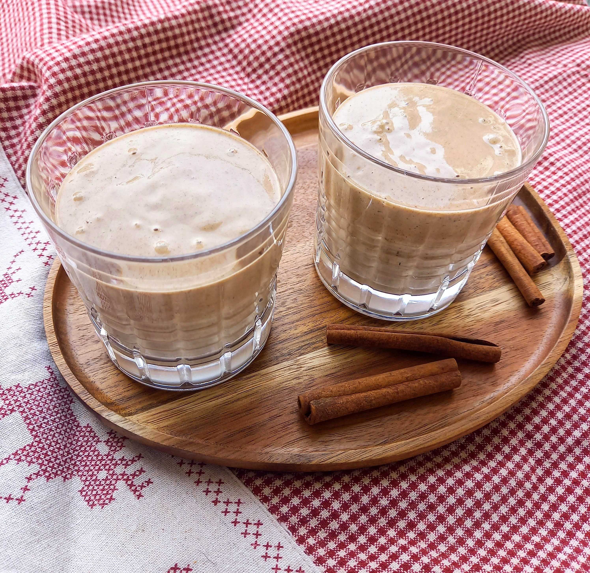

# Labai Kalėdinis kokteilis

 Gurkšnodami šį kokteilį tikrai pajusite artėjančių Kalėdų dvasią. Tai itin švelnios ir kreminės tekstūros kokteilis, maloniai kvepiantis cinamonu ir subtiliu muskato riešutų bei gvazdikėlių aromatu. Tačiau jo privalumai tikrai neapsiriboja tik geru skoniu, malonia tekstūra ir Kalėdų tradiciniais prieskoniais. Dėl sudėtyje esančių sezamų ir kanapių sėklų, šis kokteilis dar ir labai maistingas. 😊

## Jums reikės (2-3 porcijos)

* 3 virtuvinių šaukštų sezamo sėklų
* 4 džiovintų figų
* Žiupsnelio druskos
* 3 bananų
* 4 v. šaukštų lukštentų kanapių sėklų
* 1 a. šaukštelio cinamono
* Žiupsnelio muskatų
* Žiupsnelio gvazdikėlių 
* Pusės, mažos citrinos sulčių
* 2 v. šaukštų sirupo (mes naudojome datulių)
* 400 ml avižų pieno

## Paruošimas

1. Jei jūsų virtuvinis blenderis nėra itin galingas, rekomenduojame iš anksto užmerkti sezamo sėklas ir datules. Maždaug 4-8 valandoms. 
2. Visus ingredientus sudėkite į indą, užpilkite augaliniu pienu ir įspauskite citrinos sulčių.
3. Trinkite virtuviniu blenderiu dideliu greičiu, kol viskas susiplaks iki vientisos, kreminės konsistencijos.

Skanaus šventinio laukimo :)

