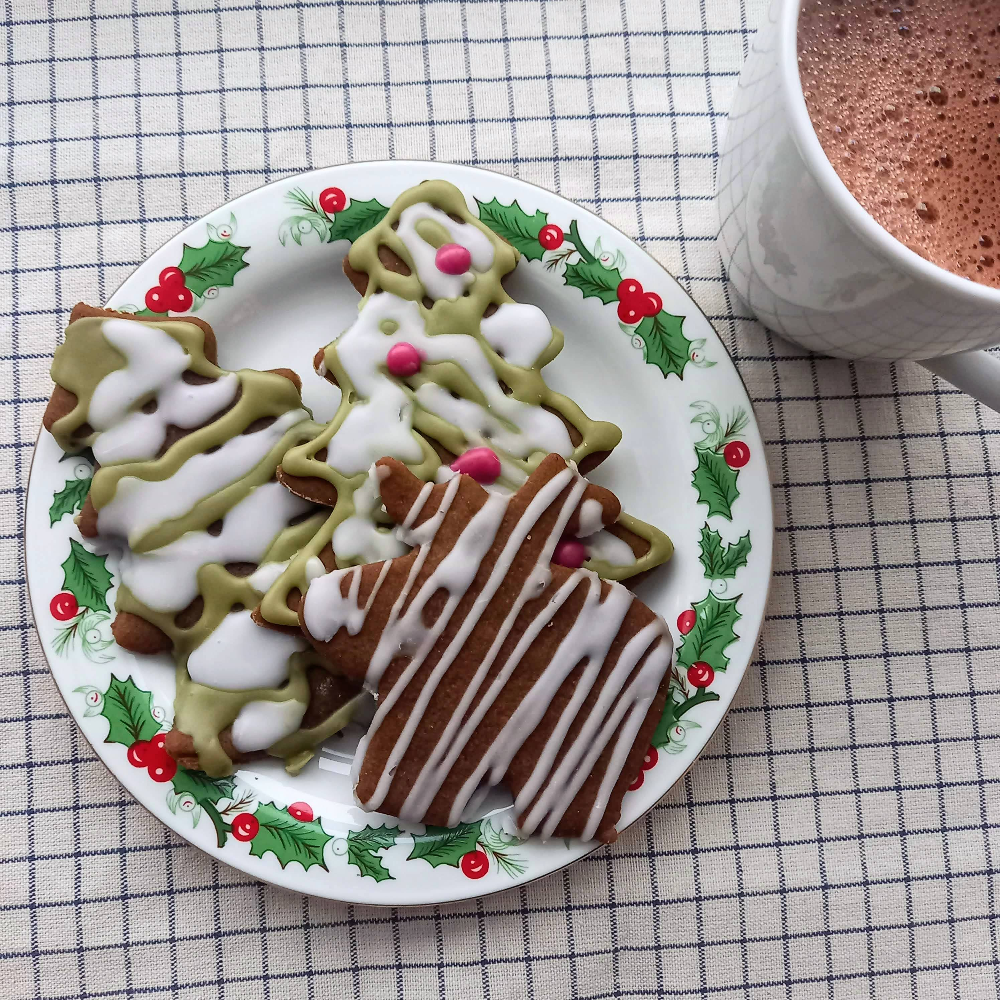

# Laikas kepti meduolius!

Kokios gi Kalėdos be imbierinių meduolių kepimo? Imbieriniai meduoliai ne tik papuošia Kalėdinį stalą, bet ir gali tapti miela, rankų darbo dovana. Mūsų namuose tai jau tradicija - kepti, dekoruoti naminius meduolius ir vežtis į svečius kaip dovaną. O ką jau kalbėti apie smagiai praleistą laiką kartu su šeima, kai visi kartu kočioja tešlą, spaudžia formeles ir kantriai, kruopščiai puošia meduolius... O vakare prie šviečiančios eglutės žiūrėti filmą kramsnojant šviežius meduolius su karšta kakava. Oi tas šio laikotarpio jaukumas... :)

## Jums reikės:

* 400 g miltų
* 170 g sviesto
* 100 g rudojo cukraus
* 210 g melasos
* 1 a. š. kepimo miltelių
* 0,5 a. š. kvapiųjų pipirų, muskato ir kardomoji mišinio (prieš tai atskirame indelyje maišome 0,5 a. š. muskato, 0,5 kardamono, 1/4 a.š. juodųjų pipirų)
* 1,5 a. š. cinamono
* 2 a. š. imbiero
* 1 a .š. vanilės pastos
* 1 v. š. riešutų sviesto
* Žiupsnelio druskos

Glajui:
* 300 g cukraus pudros
* 2-3 v. š. vandens
* Burokėlių miltelių (ruošiant rožinį glajų)
* Matcha miltelių (ruošiant žalią glajų)

## Paruošimas

1. Nedideliame puode ištirpiname sviestą. Suberiame cukrų ir ištirpiname maišydami. Supilame melasą, kaitindami maišome, kad viskas išsimaišytų į vientisą masę.
2. Pasiruošiame atskirame indelyje prieskonių mišinį: dedame 0,5 a.š. trinto muskato, 0,5 a.š. kardamono, ir 1/4 šaukštelio kvapiųjų pipirų. Išmaišome.
3. Sudedame į indą visus birius produktus, gerai išmaišome.
4. Į indą su biriais ingredientais pilame atvėsusį vegan sviesto ir melasos mišinį. Įdedame vanilės pastos ir riešutų sviesto. Viską gerai išmaišome su mentele ir išminkome rankomis.
5. Tešlą inde uždengiame rankšluosčiu ir palaikome apie valandą šaldytuve.
6. Tešlą iškočiojame ant plonu sluoksniu miltais padengto paviršiaus ir spaudžiame formeles.
7. Meduolius kepame orkaitėje, įkaitintoje iki 180°C, apie 11-15 min. Laikas priklausys nuo jūsų formelių dydžio ir iškočiotos tešlos storio.
8. Meduoliams atvėsus puošiame juos cukraus glajumi, kurį paruošit tiesiog sumaišę cukraus pudrą su trupučiu vandens. Jei norisi dekoruoti su daugiau spalvų, paruoštą glajų papildykite burokėlių ar matcha arbatos milteliais.

Skanaus ir jaukaus šventinio laukimo :)

