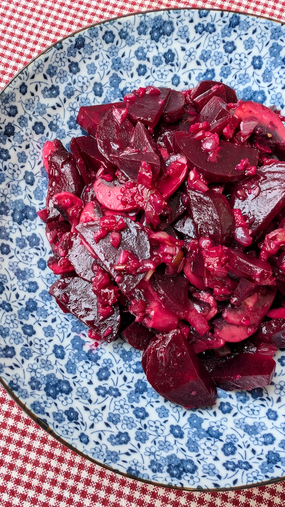

# Burokėlių salotos su pievagrybiais (Ukraina)

Kalėdos Ukrainoje anksčiau buvo švenčiamos Sausio 7 d., pagal Julijaus kalendorių, tačiau pastaruosius metus vis daugiau ukrainiečių renkasi švęsti Kalėdas Gruodžio 25 d. Abi dienos yra oficialiai pripažintos šventinėmis ir nepaisant pasirinktos dienos išlieka svarbios tos pačios ukrainiečių Kalėdų šventimo tradicijos ir simboliai.

Danguje nušvitus pirmajai žvaigždei šeimos renkasi valgyti Kūčių (*Sviata Vecheria*). Per Kūčias Ukrainoje nevalgoma mėsa, kiaušiniai ir pieno produktai, o pagrindinis patiekalas, nuo kurio ir yra pradedama vakarienė, yra *Kutia* - virti kviečiai su aguonomis ir medumi, dažniausiai pagardinama džiovintais vaisiais, riešutais. *Kutia* simbolizuoja žmonijos vienybę ir ryšį su Dievu ir mirusiųjų pasauliu.

Kūčių vakarienei ruošiama 12 patiekalų, o daugelis jų turi ir simbolines reikšmes. Po *Kutios* toliau įprastai yra valgomi barščiai - tai harmonijos ir taikos simbolis. Barščiai dažnai patiekiama su *pampuškomis* (bandelėmis aplietomis česnakiniu aliejumi). Kūčioms dažnai gaminami ir balandėliai (*holubtsi*) su ryžių ir grybų įdaru, ukrainietiški koldūnai (*varenyky*) su bulvėmis ar kopūstais. Kartais viename iš koldūnų paslepiama moneta, tikima, kad ją radęs žmogus kitais metais bus turtingas.

Ukrainoje pagrindinė namų dekoro detalė yra *didukh* - kviečių ryšulėliai, simbolizuojantys protėvių dvasias. Tikima, kad šiomis šventomis dienomis protėviai sugrįžta pabūti su savo šeima. Dėl šios priežasties po Kūčių vakarienės ant stalo paliekama *Kutia* ir kitas maistas, kaip vaišės mirusių artimųjų dvasioms. 

Eglutės ir namų langai čia dažnai puošiami iš popieriaus karpytomis snaigėmis. O ant ukrainiečių kalėdinių eglučių galima pamatyti netradicinių dekoracijų - voriukų (*Pavuchky*) ir jų tinklų, kurie simbolizuoja legendą apie voriuką papuošusį neturtingos šeimos eglutę savo tinklais ir atnešusiu jiems sėkmę. 

Kalėdų rytą visi sveikina vieni kitus skelbdami Kristaus gimimą (sakoma "Kristus gimė!" ir atsakoma "Šlovinkime Jį!"). Daugelis šeimų eina į Kalėdų pamaldas bažnyčioje, lanko savo draugus ir giminaičius. Vaikų grupelės gieda Kalėdines giesmes savo šeimoms, draugams ir kaimynams. Tikima, kad kuo daugiau ateis giesmininkų, tuo sėkmingesni ir turtingesni bus kiti metai. Apsilankę giesmininkai apdovanojami pinigėliais ar saldumynais.

Šiandienos receptas - burokėlių salotos su keptais pievagrybiais, kurios yra vienas iš populiarių ukrainietiškų Kūčių patiekalų. Lengvai ir greitai paruošiama, ryšku tiek spalvomis, tiek skoniu. Išbandykite :)

## Jums reikės

* 500 g virtų burokėlių
* 1 vnt. svogūno
* Aliejaus kepimui
* 300 g pievagrybių
* 3 vnt. česnako skiltelių
* 2 a. š. cukraus
* 2 a. š. obuolių acto
* Druskos ir juodųjų pipirų pagal skonį
## Paruošimas

1. Susmulkiname svogūną ir griežinėliais supjaustome pievagrybius. 
2. Keptuvėje su įkaitintu aliejumi apkepame svogūnus ir jiems suminkštėjus sudedame kartu kepti pievagrybius. Kepame vis pamaišant keletą minučių. 
3. Pievagrybiams apkepus įspaudžiame česnako skilteles. Švelniai pakepiname apie minutę.
4. Virtus burokėlius pjauname per pusę ir susmulkiname pusžiedžiais. 
5. Inde maišome burokėlius su keptais svogūnais ir pievagrybiais, supilant iš kpetuvės viską su aliejumi, kuriame kepė. Įdedame druskos ir pipirų pagal skonį, cukraus ir obuolių acto. Viską išmaišome. 
6. Mišrainę patiekiame pilnai atvėsintą. 

Ramaus ir jaukaus šventinio laukimo.
