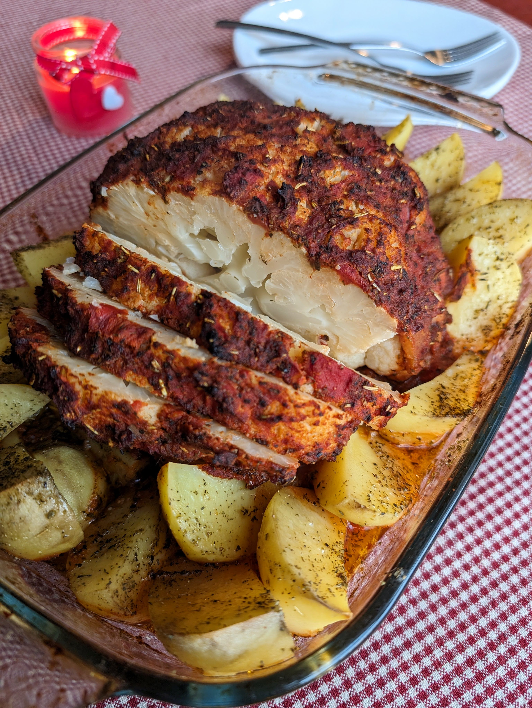

# Orkaitėje keptas žiedinis kopūstas

Orkaitėje keptas žiedinis kopūstas su prieskoningu padažu puikiai pakeis kepsnį į augalinę, sveikesnę alternatyvą ir be jokios abejonės atkreips visų svečių dėmesį. Aromatingas, ryškaus skonio padažas ir švelnus, minkštas viduje žiedinis kopūstas sukuria darnią skonių harmoniją. Ir pripažinkim, atrodo šis patiekalas tikrai įspūdingai. :)

## Jums reikės

* Vieno didelio žiedinio kopūsto
* 1 skardinės pjaustytų pomidorų gabalėlių savo sultyse (400 g)
* 3 v.š. alyvuogių aliejaus
* 1 v.š. rūkytos paprikos
* 2 a.š. česnako granulių
* 1 a.š. kumino 
* 1 a.š. baziliko
* 1 a.š. raudonėlio
* 1 a.š. rozmarino
* 1 a.š. krapų
* Žiupsnelis juodųjų pipirų

* Rekomenduojame kartu orkaitėje išsikepti ir bulvių skilteles. 

## Paruošimas

1. Pasiruošiame žiedinį kopūstą: švariai nuplauname, nupjauname lapus ir patrumpiname kotelį. 
2. Žiedinį kopūstą paverdame sūdytame vandenyje 5 min, dangčiu uždengtame puode (vanduo gali neapsemti viso žiedinio kopūsto). Žiediniam kopūstui apvirus, nupilame vandenį. 
3. Pasiruošiame padažą: sumaišome pjaustytus pomidorus su jų sultimis kartu su prieskoniais ir alyvuogių aliejumi. 
4. Žiedinį kopūstą dedame į orkaitėje kepti pritaikytą indą ir ištepame žiedinio kopūsto paviršių paruoštu padažu. 
5. Kartu kepti sudedame bulvių skilteles, apšlakstytas aliejumi ir pabarstytas žoliniais prieskoniais, druska ir trupučiu juodųjų pipirų.
6. Žiedinį kopūstą ir bulves kepame 180C temperatūroje apie 50-60 min. Patikriname dantų krapštuku ar daržovės minkštos, jei reikia pakepame dar papildomai. 

P.S. Nepamirškite, kad restoranas "Holigans" dar iki rytojaus dalina dovanas (daugiau informacijos 11 d. langelyje)!!! 😊 

Skanaus šventinio laukimo!

