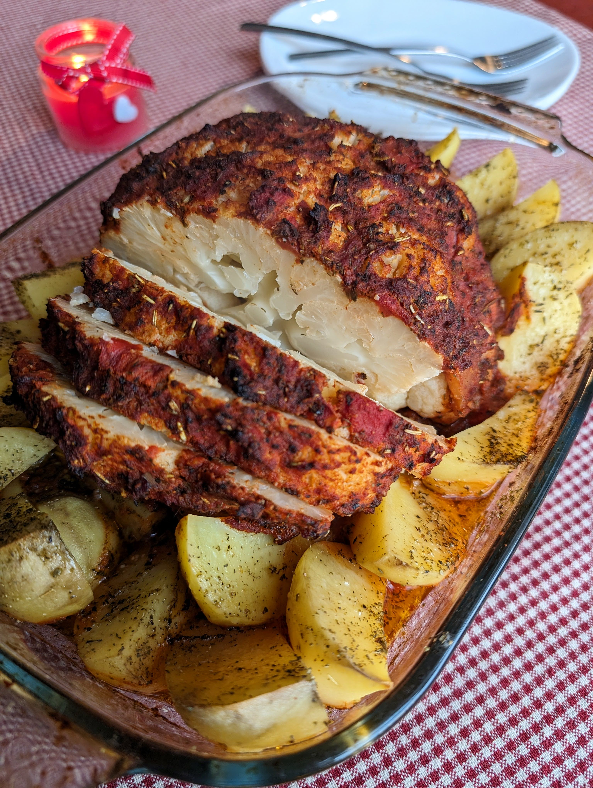

# Tinginys

 Nauja ir mūsų šeimos pamėgta Tinginio versija. Drėgnas, minkštas, karamelinis su pistacijomis ir liofilizuotomis braškėmis. Ne tik skanus, bet ir labai dailus, spalvingas desertas.

Tobulas, niekada nenuviliantis pasirinkimas visiems skubantiems ir visada užsiėmusiems saldumynų mėgėjams.:)

## Jums reikės

* 4 pakuočių "Du gaideliai" sausainių 
* 1 skardinės kokosų kondensuoto pieno
* 200 g augalinio sviesto 
* 80 g lukštentų pistacijų
* 25 g liofilizuotų braškių

## Paruošimas

1. Gabalėliais sulaužome sausainius.
2. Išlydome augalinį sviestą ir įmaišome kokosų kondensuotą pieną. Išmaišome iki vientisos masės.
3. Išlukštename pistacijas ir susmulkiname peiliu.
4. Į dubenį su sausainiais suberiame pistacijas, dedame liofilizuotas braškes, kurias rankomis palaužome į norimo dydžio, smulkesnius gabalėlius. Ir supilame kondensuoto augalinio pieno, lydyto augalinio sviesto mišinį. 
5. Viską gerai išmaišome.
6. Dedame šaukštu paruoštą tinginio masę ant kepimo popieriaus, vyniojame ir suslegiame. Dedame į šaldytuvą stingti per naktį.

Skanaus šventinio laukimo!

