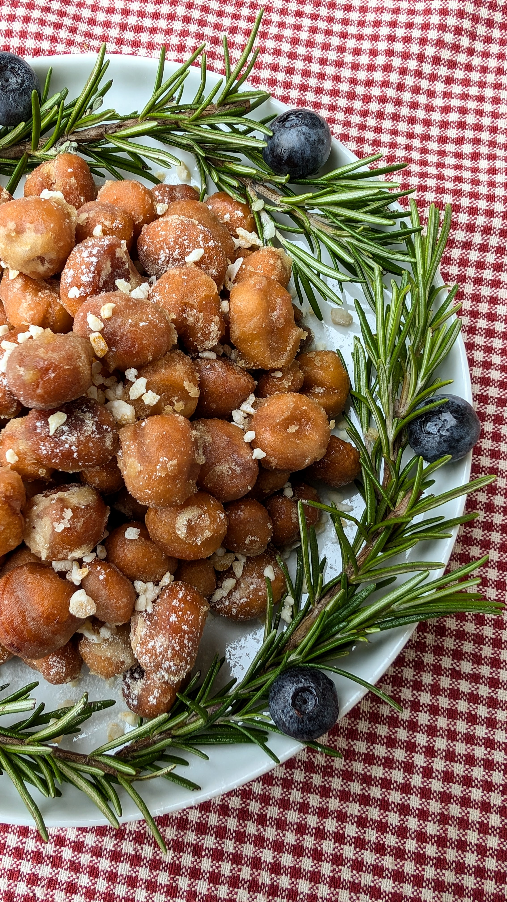

# Struffoli - traškūs rutuliukai padengti klevų sirupu (Italija)

Italijoje Kalėdinis laikotarpis oficialiai prasideda Gruodžio 8 d.. Tada Italijos miestų centrinėse aikštėse įžiebiamos lemputės, puošiamos elgutės ir pradeda veikti kalėdinės mugės, o italai pradeda ruošti savo namuose prakartėles. Kitaip nei daugelyje Vakarų valstybių, Kalėdų laikotarpiu italams svarbiausia namų puošmena visai ne eglutė, o prakartėlė, kuri pas daugelį būna didelė, detali, išsiplečianti į miniatiūrinius kaimelius, su daug skirtingų figurėlių (*pastorini*), kurios perduodamos iš kartos į kartą. Pakartėlės statomos ne tik namuose, bet ir miestų aikštėse, o tam tikruose Italijos regionuose galima pamatyti ir gyvas prakartėles su tikrais gyvūnais ir aktoriais. 

Dalyje šiaurinių Italijos regionų tikima, kad Gruodžio 13 d. lankosi ir geriems vaikams dalina dovanas šventoji Lucy (*St. Lucy*), kuri atskrenda su skraidančiu asiliuku. Vaikai palieka jai kavos ir morkų jos asiliukui. O Veronoje *Santa Lucia* garbei rengiama didžiulė kalėdinė mugė.

Gruodžio 16 d. prasideda *La Novena*- devynių dienų laikotarpis iki Kalėdų reprezentuojantis trijų Karalių ėjimą pas kūdikėlį Jezų. Kaimuose vaikai turi tradiciją apsirengti Trimis Karaliais ir eiti nuo namų prie namų giedodami giesmes, ir deklamuodami eilėračius, mainais į saldainius. Šiuo laikotarpiu Italijos bažnyčiose ir teatruose vyksta daug šventinių renginių ir kalėdinių spektaklių. 

Nors į italų Kalėdų šventimo kultūrą atėjo ir Kalėdų senelis. Visgi, pagrindinė, tradicinė dovanų nešėja yra *La Befana* - draugiška raganaitė, kuri skrenda ant savo šluotos ir Sausio 6 d. pripildo gerų vaikų kojines saldainiais, dovanėlėmis, o išdykusių - anglimi. Legenda sako, kad *La Befana* paklydo sekdama paskui Tris Karalius ir nuo to laiko klaidžioja dalindama visiems dovanas. Ši šventė žymi Kalėdinio laikotarpio Italijoje pabaigą.

Aliejuje kepti medaus rutuliukai yra tradicinis Italijos skanėstas, populiarus ne tik per Kalėdas ir Naujuosius metus, bet kartais gali būti patiekiamas net per Velykas. Saldūs, traškūs, su gaiviu citrusų aromatu ir pagaminami iš paprastų ingredientų. Augalinėje versijoje medų puikiai pakeičia saldus klevų sirupas. Italai Struffoli formuoja į piramides reprezentuojant eglutę arba vainiko formos, puošia gausiai barstydami pabarstukais ar cukruotais vaisių gabaliukais. Ruošiami Kalėdoms iš vakaro, kadangi kitą dieną jie būna traškesni. :)

## Jums reikės

* 300 g kvietinių miltų
* 190 g (~3/4 puodelio) obuolių tyrės 
* 1 v. š. cukraus
* 1 v. š. aliejaus
* 1 vnt. citrinos
* Žiupsnelio druskos
* Aliejaus kepimui
* Pabarstukų (papuošimui; tinka saldūs pabarstukai, kokosų drožlės, riešutų ar cukruotų apelsinų gabaliukai)
* Šviežių rozmarinų ir šilauogių, ar raudonųjų serbentų (papuošimui)

## Glajui reikės

* 200 g klevų sirupo
* 50 g cukraus

## Paruošimas

1. Dideliame inde maišome miltus, cukrų, obuolių tyrę, aliejų. Įtarkuojame citrinos žieveles, įdedame žiupsnelį druskos.
2. Išminkome tešlą ant miltais pabarstyto paviršiaus (~10 min.) ir paliekame uždengtą pastovėti apie valandą kambario temperatūroje (ši dalis svarbi, jei tešla nebus pastovėjusi kambario temperatūroje, ji stipriai trauksis košiojant ir formuojant juosteles).
3. Tešlą daliname į 8 dalis ir kiekvieną tešlos gabaliuką formuojame rankomis į ilgą virvutę/juostelę (apie 30-40 cm). Tai darome ant miltais nepabarstyto, sauso paviršiaus. Juostelę supjaustome smulkiai, panašaus dydžio gabalėliais.
4. Įkaitiname aliejų iki maždaug 170°C-180°C laipsnių (pravartu turėti virtuvinį termometrą, kadangi tinkama temperatūra svarbi tolygiam rutuliukų kepimui). Pasiruošiame lėkštę padengtą virtuviniu popieriumi.
5. Į įkaitintą aliejų dedame maždaug po saują tešlos gabaliukų (prieš dedant į aliejų tešlos gabaliukus tarp delnų pasukame, kad jie suapvalėtų. Rutuliukai turi būti maži, kepant jie šiek tiek dar išsipučia). Kepame aliejuje, kol tolygiai paruduoja. Atsargiai, sausu šaukštu ar kiaurasamčiu vis pamaišome, kad apkeptų tolygiai visos rutuliukų pusės. Iškepus juos išimame su kiaurasamčiu ir dedame ant lėkštės padengtos virtuviniu popieriumi, kad sugertų perteklinį aliejų.
6. Ruošiame glajų. Į keptuvę dedame cukraus ir pilame klevų sirupą. Įkaitiname, kol ištirpsta cukrus, o mišinys pradeda lengvai virti, pakaitiname keletą minučių, kol jis šiek tiek sutirštėja. Tuomet į keptuvę beriame rutuliukus ir juos vartant tolygiai padengiame saldžiu, klevų sirupo mišiniu.
7. Patraukiame keptuvę nuo kaitros ir leidžiame rutuliukams keletą minučių atvėsti. Tuomet permaišome ir perkeliame ant lėkštės. Galima formuoti kaip vainiką ir jį papuošti aplinkui išdėliojant rozmarino šakeles, papuošiant pabarstukais ar uogomis. Šie rutuliukai atvėsę sustingsta ir sulimpa, prie stalo įprastai yra laužiami rankomis. 

Skanaus šventinio laukimo!

