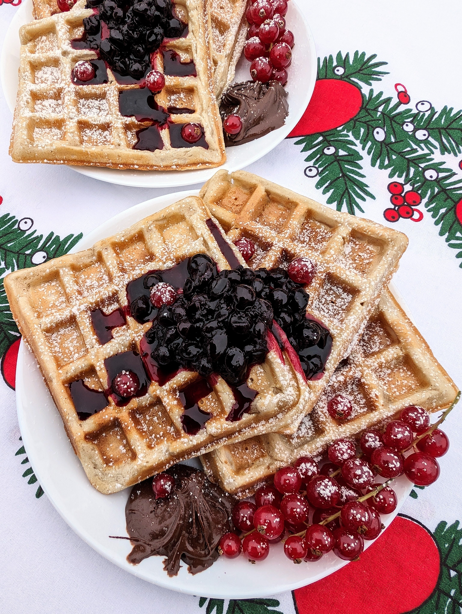

# Saldūs vafliai

Prieš paskutinis savaitgalis prieš visų laukiamas šventes. Tai, kodėl gi sekmadienio nepradėjus lėtai, palepinant save ir leidžiant bent šiek tiek atsikvėpti, pasimėgaujant saldžiais vafliais ir jaukia filmo peržiūra gurkšnojant karštą kakavą? 😊
Na, o jei prie jūsų Kalėdinio stalo susirenka ir mažieji, išrankieji svečiai, galbūt būtent vafliai šventinei vakarienei juos gali pradžiuginti? 😊

## Jums reikės

* 500 ml augalinio pieno
* 500 g kvietinių miltų
* 5 v. š. cukraus
* 2 v.š. kepimo miltelių
* 90 g aliejaus
* 1,5 v.š. riešutų sviesto
* 1 banano
* 1 a.š. vanilės ekstrakto
* 1 a.š. cinamono
* 0,5 a.š. druskos

## Paruošimas

1. Sumaišome visus ingredientus inde iki vientisos tešlos.
2. Kepame įkaitintoje, aliejumi pateptoje vaflių keptuvėje, kol gražiai apskrunda.
3. Pridedame mėgstamų priedų: uogų, vaisių, mėgstamos uogienės, klevų sirupo, riešutų sviesto ar šokoladinio kremo. Kas tik jums patinka! 

P.S. Nepamirškite, kad restoranas "Holigans" dar šiandien dalina Kalėdines dovanas (daugiau informacijos 11 d. langelyje). O paspaudus ant vainiko su filmo rekomendacija, galite peržiūrėti rekomenduojamo filmo trailer'į!!! 😊 

Skanaus šventinio laukimo!

