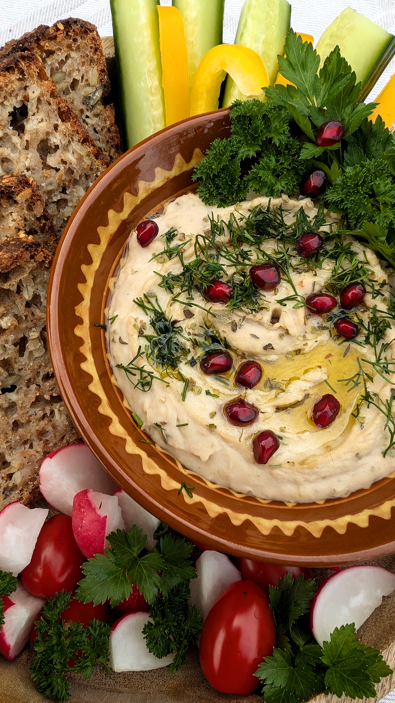

# Sviestinių pupelių užtepėlė

Pabodo naminis humusas? Turime puikią alternatyvą. Švelnaus skonio, kreminės tekstūros sviestinių pupelių užtepėlė. Skanu tepti ant duonos ar į ją mirkyti šviežias daržoves. 😊

## Jums reikės

* 480 g sviestinių pupelių (dvi skardinės)
* 4 vnt. česnako skiltelių
* 2,5 v.š. sezamo pastos (Tahini)
* 3 v.š. alyvuogių aliejaus
* 1 a.š. kumino
* ~70 ml vandens
* 1/4 citrinos šviežiai spaustų sulčių
* Druskos
* Provanso žolelių mišinio

## Paruošimas

1. Sviestines pupeles sudedame į indą. Įpilame alyvuogių aliejaus, šiek tiek vandens. Dedame Tahini ir prieskonius. 
2. Įspaudžiame citrinos sulčių ir šviežio česnako. 
3. Viską sutriname iki vientisos, kreminės tekstūros. Jei norisi skystesnės tekstūros užtepėlės įpilame dar šlakelį vandens.

Skanaus šventinio laukimo!

