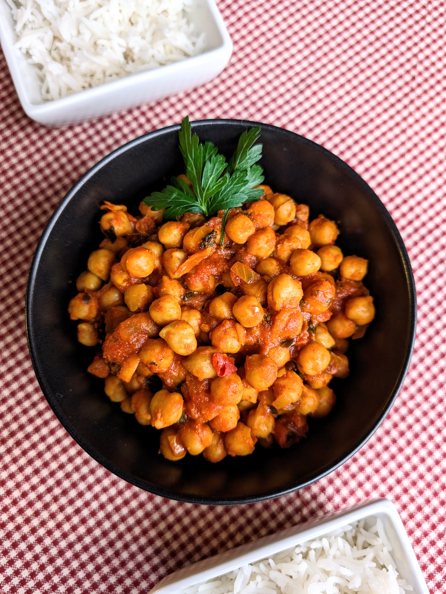

# Avinžirnių karis

Avinžirnių karis - lengvai ir greitai paruošiamas, nereikalaujantis sudėtingų ingredientų, tuo tarpu skonis nuostabus. Tai jaukus, sušildantis ir komfortiškas patiekalas, pasižymintis lengvu aštrumu. Puikiai tinka patiekti kartu su basmati ryžiais. 😊

## Jums reikės

* 3 skardinių avinžirnių (720 g)
* 2 a.š. kario
* 2 a.š. paprikų miltelių
* 1 a.š. druskos
* 0,5 a.š. baltųjų pipirų (galima keisti žiupsneliu juodųjų pipirų)
* 1 a.š. kumino
* 2 česnako skiltelių
* Džiovintos ožragės (nebūtina)
* Žiupsnelis maltų čili dribsnių
* 240 g pomidorų padažo
* ~150 ml vandens
* Pusės žaliosios citrinos sulčių
* Basmati ryžių
* Petražolių arba kalendros (nebūtina, naudojama papuošimui)

## Paruošimas

1. Smulkiai supjaustome svogūną ir apkepame su aliejumi, kol suminkštėja.
2. Įspaudžiame česnaką, įdedame kario, paprikų ir žiupsnelį čili dribsnių, pakepame dar porą minučių. 
3. Suberiame avinžirnius, įdedame pomidorų padažo ir įpilame vandens. Suberiame prieskonius, druską, pipirus. Įdedame kumino ir jei naudojame, suberiame ožrages. Išmaišome ir patroškiname viską, kol karis sutrištėja. 
4. Įspaudžiame citrinos sulčių. 
5. Patiekiame su virtais basmati ryžiais. Papuošiame šviežiomis kalendromis ar petražolėmis. 

Skanaus šventinio laukimo!

