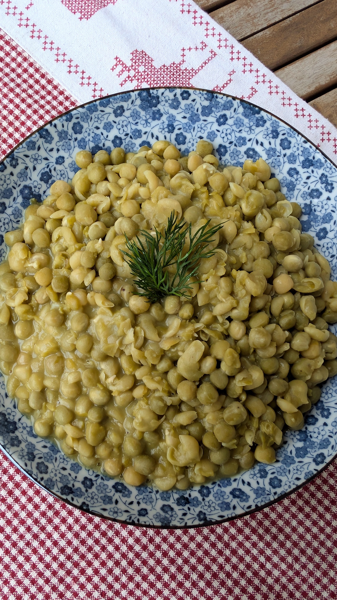

# Žaliųjų žirnių troškinys (Norvegija)

Norvegijoje Kalėdų laukimas yra ne mažiau svarbus ir ypatingas, nei pačios Kalėdos. Kalėdų čia laukiama ne tik su šokoladukais pripildytais Advento kalendoriais, bet ir smulkiomis dovanomis, tad jau vien iki Kalėdų dienos norvegai gauna 24 dovanas. Neblogai, tiesa? 

Švęsti pradedama jau Gruodžio 23 - "Mažosios Kūčios" ("Little Christmas Eve"; norvegiškai - “*Lille Julaften*”). Daugelis šeimų turi savo ypatingų tradicijų šiai dienai: puošia eglutes, dekoruoja meduolinius namelius ir vaišinasi *risengrynsgrøt* - karštu ryžių pudingu su cinamonu, cukrumi ir sviestu. Iš *risengrynsgrøt* likučių dažnai ruošiamas ir populiarus Kalėdų desertas - *riskrem* - šaltas ryžių pudingas su plakta grietinėle, kuris Norvegijoje pagardinamas aviečių ar braškių uogiene. Ir nepriklausomai nuo dienos, kada jis bus valgomas, svarbiausia jame paslėpti vieną migdolą (visai kaip Danijoje).

Pagrindinė šventė yra Gruodžio 24 dieną, per Kūčias. Šeimos po mišių bažnyčioje susirenka šventinės vakarienės namuose ar pas savo giminaičius. Po vakarienės keičiasi dovanomis. Dovanos Norvegijoje įprastai išpakuojamos po vieną kartu su visa šeima, o ne visos vienu metu, ir tai dažnai gali užtrukti net keletą valandų. Pas norvegus Kalėdų senelis (*Julnissen*) atkeliauja ne per kaminą, o tiesiog pasibeldžia į duris ir įeina su pilnu maišu dovanų. 

Įdomus faktas, kad kasmet, Gruodžio 24 dienos rytą didžioji dalis norvegų žiūri seną, 1973 metų, Čekijos filmą "Pelenė". Šis filmas Norvegijoje ypatingai populiarus, o 2021 m. norvegai sukūrė savo filmo versiją "Three Wishes for Cinderella" (lietuviškai "Trys Riešutėliai Pelenei"), kuris buvo filmuotas Lietuvoje, Trakų pilyje. 

Norvegijoje tikima, kad nykštukai (*Nisse*) gyvena tvartuose. Jie slepiasi šiene ir pasirūpina fermos gyvūnais, kad jie nesusirgtų žiemą. Todėl, kaip padėką nykštukams už rūpestį gyvūnais, ūkininkai ant namų laiptų palieka Kalėdų pudingo *Julegrøt* , kuris būtinai turi būti su gabaliuku sviesto per vidurį, kitaip nykštukai gali supykti, o gyvūnai - apsirgti. Kalėdinio pudingo dažnai paliekama ir Kalėdų seneliui (*Julnissen*), kad atsidėkoti už visas dovanas. :)

Kalbant apie Kalėdinį meniu, šventinis stalas pas norvegus nukrautas mėsos ir žuvies patiekalais, tačiau labiausiai šokiruoja, kad vienas iš tradicinių ir labai senų receptų yra garinta, rūkyta avies galva. Tai laikoma delikatesu, bet atrodo tikrai kraupiai... Garnyrui populiaru ruošti virtas bulves ar bulvių košę, žaliųjų žirnių troškinį, raugintus kopūstus. O desertui dažnai jau Lapkritį pradedami kepti 7 rūšių (*de syv slag*; angl. the seven types) Kalėdiniai sausainiai. Norvegijoje įprasta sakyti "pradėjau kepti 7 rūšis" ir visi žino, apie kokius sausainius kalbama. Yra oficialus, tradicinis 7 rūšių sausainių sąrašas. Tačiau dalis norvegų griežtai šio sąrašo nesilaiko ir Kalėdoms kepa savo mėgstamas sausainių rūšis, svarbiausia, kad jos būtų septynios. 

Šiandien išbandysime norvegų Kalėdinio stalo tradicinį garnyrą - žaliųjų žirnelių troškinį, kuriam naudojami vos keli paprasti ingredientai. Įprastai naudojami džiovinti žalieji žirniai, kurie mirkomi per naktį, ilgai verdami (~1 val.) ir maišomi, kol pradeda šiek tiek byrėti. Džiovintų žaliųjų žirnių parduotuvėje neradus, verta pabandyti ir su šaldytais. Tiesa, tekstūra gausis kiek kitokia. Šaldyti žirneliai taip nesuverda į košę/troškinį, geriau išlaiko savo formą, bet skonis bus tikrai geras, išbandėme patys. Labai paprastas, bet skanus ir jaukus garnyras, kuris puikiai tiktų kartu su įvairiais augaliniais kepsneliais, keptu tofu ar orkaitėje keptomis daržovėmis.

## Jums reikės 

* 250 g sausų, džiovintų žaliųjų žirnių (arba 400 g šaldytų žaliųjų žirnelių)
* 2 v. š. rapsų aliejaus (galima keisti ~50 g augalinio sviesto)
* ~ 1 a. š. cukraus (arba pagal skonį)
* Druskos ir juodųjų pipirų pagal skonį

## Paruošimo eiga

1. Džiovintus žirnius mirkome vandenyje per naktį.
2. Nupilame vandenį, nuplauname žirnius. Žirnius suberiame į puodą ir užpilame vandeniu, kad juos pilnai apsemtų (virš žirnių turėtų būti apie 1 cm vandens). Verdame vis pamaišant apie 1 val., pravirame puode, kad galėtų išeiti garai. Verdame, kol nugaruoja didžioji dalis vandens, žirniai pradeda maišant šiek tiek byrėti, o troškinys tirštėti. Jei troškinys gautųsi per tirštas įpilkite šiek tiek virinto vandens. (Jei naudojate šaldytus žaliuosius žirnelius, juos nuplaukite ir supilkita į puodą, užpilkite vadeniu, kad pilnai apsemtų. Ant nedidelės kaitros, švelniai virkite apie 1 val., puodo dangtį laikome šiek tiek atkeltą, kad galėtų išeiti garai. Verdame, kol didžioji dalis vandens nugaruoja, o žirniai pradeda šiek tiek byrėti.)
3. Pagardiname druska ir pipirais, įdedame šiek tiek cukraus. Viską išmaišome.
4. Patiekiame karštą, kaip garnyrą su keptu tofu ar augaliniais kepsneliais. 

