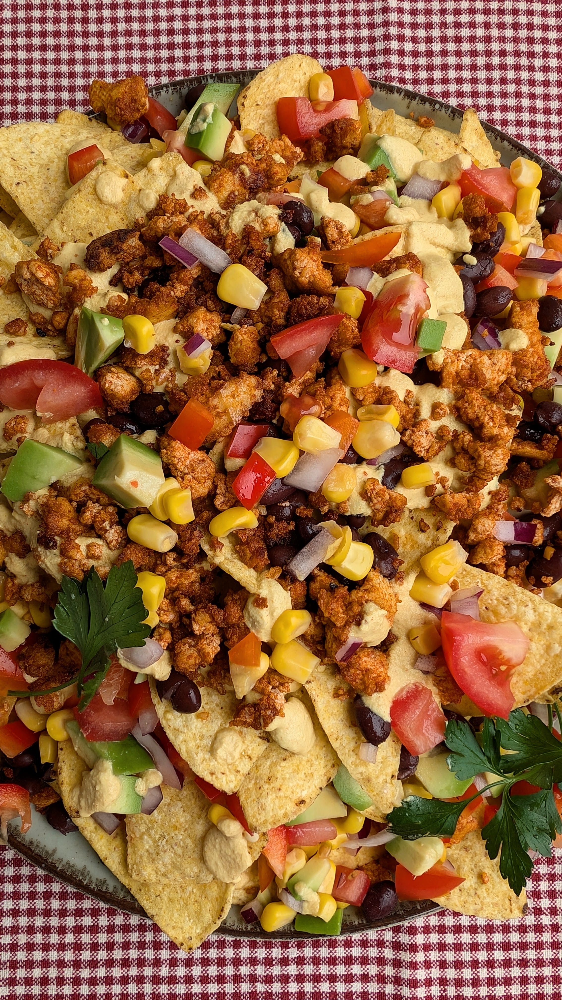

# Daržovėmis ir tofu užkrauti Natchos

Šiandien dalinamės skania idėja užkandžiams. Kukurūzų traškučiai gausiai užkrauti orkaitėje keptu tofu ir šviežiomis daržovėmis, aplieti pikantišku padažu. Skamba gerai? :) Patikėkit, šiuo užkandžiu taip smagu dalintis artimų žmonių rate, kartu žiūrint nostalgišką Kalėdinį filmą ir rankomis kabinant kukurūzų traškučius su gausiais priedais. 

## Jums reikės

* Kukurūzų traškučių (~350 g)
* 240 g konservuotų juodųjų pupelių 
* 0.5 raudonojo svogūno 
* 3 vnt. pomidorų
* 1 vnt. paprikos
* 140 g saldžių konservuotų kukurūzų 
* 1 vnt. avokado
  
## Orkaitėje keptam tofu reikės
* 360 g tofu
* 2 v.š. pomidorų padažo 
* 1 a.š. rūkytos paprikos
* 2 v.š. alyvuogių aliejaus 
* 1.5 v.š. česnako granulių 
* 1 a.š. kumino
* 1 a.š. saldžios paprikos 
* Žiupsnio druskos ir pipirų 
* Šviežių petražolių (nebūtina; papuošimui)

## Padažui reikės
* 100 g anakardžių (mirkytų bent valandą)
* 150 ml vandens
* 1 a.š. rūkytos paprikos 
* 0.5 a.š. ciberžolės
* 1 a.š. česnako granulių 
* 0.5 a.š. cukraus
* Žiupsnio druskos 
* Šlakelio citrinos
* 1 v.š. maitinių mielių (nebūtina, bet rekomenduojama)

## Paruošimas

1. Ruošiame orkaitėje keptą tofu. Tofu susmulkiname jį sutrindami rankomis į smulkius gabalėlius. Permaišome su pomidorų padažu ir aliejumi, bei prieskoniais. Paskirstome ant kepimo popieriumi padengtos kepimo formos ir kepame orkaitėje, 200°C temperatūroje, kol tofu apskrus.
2. Pasiruošiame padažą. Visus padažo ingredientus sudedame į virtuvinį trintuvą ir sutriname iki vientisos tekstūros padažo. 
3. Papjaustome kubeliais pomidorus, avokadą ir papriką, susmulkiname pusę svogūno. Viską sumaišome, apšlakstome citrinos sultimis ir pabarstome žiupsneliu druskos pagal savo skonį.
4. Ruošiame Natchos patiekimui ant didelės lėkštės. Dedame sluoksnį kukurūzų traškučių ir apšlakstome padažu (šiek tiek padažo dar pasiliekame). Pabarstome keptu tofu, pupelėmis ir kukurūzais. Pabarstome daržovėmis. Dedame antrą sluoksnį kukurūzų traškučių, daržovių mišinį, paskirstome ant viršaus kaptą tofu ir pabarstome juodųjų pupelių. Ant viršaus beriame kukurūzų ir pašlakstome padažu. Galima sluoksniuoti pagal savo skonį ir fantaziją. :) Papuošiame šviežiais petražolių lapeliais.

Skanaus!

P.S. Primename, kad dar šiandien galioja restorano "Vieta" specialus pasiūlymas: 2024-12-19 d. dovanoja 10% nuolaidą užsakymams su slaptažodžiu: Kalėdos Vietoje.