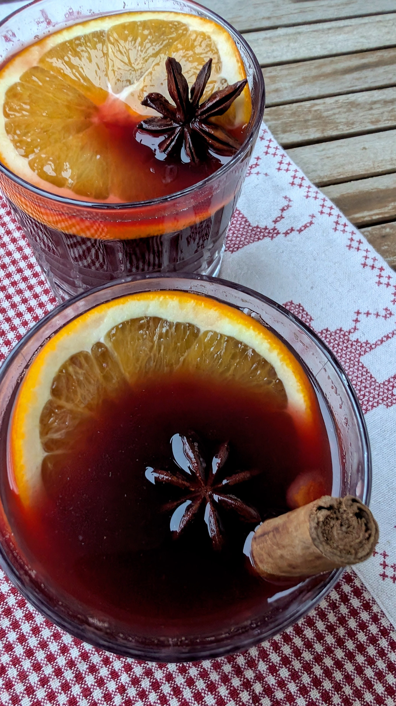

# Skandinaviškas gėrimas Gløgg be alkoholio (Švedija)

Viena populiariausių kalėdinių dekoracijų Švedijoje yra šiaudinė ožka (*Julbock*), kuri įprastai statoma po eglute ar ant šventinio stalo. Tuo tarpu Gävle mieste ši tradicija ypač įspūdinga, nes tradiciškai pagrindinėje miesto aikštėje statoma net 14 metrų aukščio, šiaudinė Kalėdų ožkos dekoracija. Ir lygiai taip pat tradiciškai, ši ožka beveik kasmet būna padegama. 

Nuo 1966 metų ši didžiulė miesto dekoracija buvo padegta bent 37 kartus. Iki šiol iš 59 Kalėdų laikotarpiui statytų ožkų - 42 buvo sugadintos ar pilnai sunaikintos. Kadangi dekoracijos padegimas nėra tradicijos dalis ar organizatorių užmanymas, siekiant ožką apsaugoti, ją pradėta mirkyti nedegiame skystyje, stebėti vaizdo kameromis ir statyti apsaugines tvoreles, o už jos sugadinimą net gali būti skiriami 3 mėnesiai kalėjimo. Tačiau ją apsaugoti ne taip paprasta, o dalis vandalizmo istorijų skamba ganėtinai komiškai. Pavyzdžiui:
- Ožka pavogta vieno vyruko, kuris pasistatė ją savo namų kieme (įsivaizduokit, 14 m aukščio ožką kaimyno kieme, nei kiek neįtartina, tiesa? :D). 
- Padegta šiaudinė ožką vandalų apsirengusių Kalėdų seneliu ir Meduoliniu sausainiu. :D 
- Pasiūlytas beveik 4,5 tūkstančių dydžio kyšis apsaugos darbuotojui, kad jis paliktų savo postą, kad ožką būtų galima pavogti su straigtasparniu ir išskraidinti į Stokholmą.

Dabar šio miestelio ožka turi net savo Wikipedia puslapį (https://en.wikipedia.org/wiki/G%C3%A4vle_goat), kuriame aprašoma visų ožkų baigties istorija. Tikrai rekomenduoju užsukti pasižvalgyti. :D O Youtube kanale veikia stream'as - The Gävle Goat LIVE 2025, tad karts nuo karto galite užsukti patikrinti, ar dar nedega. :D

Kalėdinė nuotaika Švedijoje pradeda kurtis jau nuo Lapkričio. Švedų namų languose nušvinta žvaigždės - popierinės, iškarpytos ir skleidžiančios šiltą, atmosferišką šviesą. O kiekvienas Advento sekmadienis tampa proga susitikti ir praleisti laiko su šeima ar draugais, dažnai gurkšnojant karštą *Gløgg* kartu su imbieriniais sausainiais ir uždegant Advento vainiko žvakes.

Švedijoje ypatingai svarbi namų puošmena yra eglutė - graži, natūrali, idealiai šakota ir papuošta vėliavėlėmis, spalvotais burbulais, lemputėmis ar blizgučiais, priklausomai nuo šeimos tradicijų. Namuose kabinamos sienų dekoracijos vaizduojančios meduolinius sausainius ar kitus Kalėdų tematikos elementus.

Kūčios yra pagrindinė Kalėdinio laikotarpio šventė. Dalis švedų sako, kad tikros šventės prasideda 3 valandą, kai per televiziją pradeda rodyti Ančiuką Donaldą (Donald Duck) ir kitą Disnėjaus klasiką. Tai ypač mėgstama švedų šeimų tradicija.

Kūčioms ruošiamas ŠVEDIŠKAS stalas su mėsos, žuvies patiekalais, salotomis ir bulvių garnyru ir specialiu, tradiciniu švedišku žuvies patiekalu - *lutfisk*, kuris turi stiprų, specifinį, nemalonų kvapą ir sakoma, kad retas kuris švedas šį patiekalą mėgsta, tačiau ji vis tiek ruošiama ir patiekiama ant stalo, nes... tai tradicija. :) Po vakarienės šeimos šoka aplink eglutę ir dainuoja kalėdines dainas, kol į duris pabeldžia Kalėdų senelis (*Jultomten*).

Šventiniu laikotarpiu ypač populiarus *Gløgg* - Švediškas alkoholinis punčas, gaminamas maišant vyną su viskiu ir romu. Jis verdamas kartu su migdolais, razinomis ir apelsinų žievelėmis, kas suteikia jam ypatingo aromatingumo ir saldumo. Tiesa, į jo sudėtį papildomai dedama ir cukraus, o tam, kad jis pilnai ištirptų, tradiciškai gėrimas yra uždegamas. Tačiau šis gėrimas gali būti ruošiamas ir be alkoholio, kuris keičiamas į vaisių ir uogų sultis. Švediškas *Gløgg* gėrimas išpopuliarėjo ir Suomijoje, bei Estijoje. 

## Jums reikės

* 1 l juodųjų serbentų sulčių 
* 80 g migdolų 
* 50 g razinų 
* 1 vnt. apelsino žievelės 
* 2 vnt. žvaigždinio anyžiaus
* 2 vnt. cinamono lazdelių
* 0,5 a. š. malto kardamono
* 7 vnt. gvazdikėlių 
* 6 vnt. kvapiųjų pipirų 
* 250 ml užvirintos juodos arbatos su cukrumi (1 a. š. birios juodosios arbatos, 1,5 a.š. cukraus, 250 ml vandens)

## Paruošimas

1. Migdolus nuplauname ir užpilame dubenėlyje karštu vandeniu. Paliekame pastovėti užmerktus bent 10 min. Tuomet nupilame vandenį ir nuimame migdolų luobeles. 
2. Į nedidelį puodą įpilame juodųjų serbentų sultis. Sudedame migdolus, razinas, žvaigždinius anyžius ir cinamono lazdeles. Į sietelį arbatai sudedame gvadikėlius ir kvapiuosius pipirus. Įdedame sietelį į sultis. Nulupame apelsino žievelę ir dedame žieveles į sultis, taip pat įdedame du apelsino griežinėlius. Įberiame kardamono. Užverdame gėrimą ir sumažinus kaitrą švelniai verdame apie 20 - 30 min, kad išsiskirtų visi prieskonių skoniai ir aromatai.
3. Puodelyje užplikome juodąją arbatą ir ją pasaldiname pagal poreikį ir skonį cukrumi. Paliekame pastovėti bent keletą minučių ir tuomet supilame per sietelį (be arbatžolių) į verdantį gėrimą. 
4. Išmaišome, išimame sietelį su smulkiais prieskoniais ir išpilstome į puodelius be prieskonių ir žievelių. Papuošiame apelsinų griežinėliais, įmerkiant cinamono lazdelę ar žvaigždinį anyžių. Patiekiame karštą. 

Skanaus!
