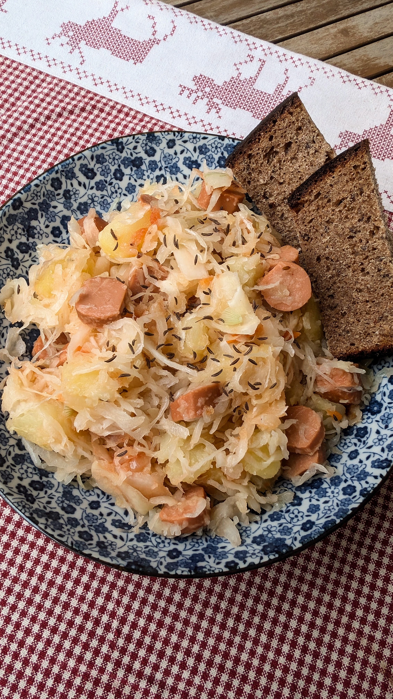

# Rauginti kopūstai su dešrelėmis (Austrija)

Gruodžio pirmąją savaitę vaikams Austrijos miestų gatvėse vaikščioti būna ganėtinai nejauku. Šiurpuliukas nubėga kūnu tolumoje pasigirdus varpelių skambėjimui ar gatvėmis besitysiančių grandinių garsui. Tai - Krampas (*Krampus*). Velnią primenanti būtybė su kailiais, ragais, besinešanti varpelius, botagą ar grandines, o dažnai ir krepšį ant nugaros - blogai besielgiantiems vaikams išsinešti. Gruodžio 5 dieną švenčiama Krampo diena, iki tol Krampas lanko įvairius Austrijos miestus, o Gruodžio 6 švenčiama šv. Nikolo diena, kai gerai besielgiantiems vaikams šv. Nikolu apsirengę žmonės dalina saldainius, mandarinus ir riešutus. 

Su Krampu ne retai maišoma *Perchten*, nors ji gana skirtinga tiek išvaizda, tiek savo paskirtimi. Tai daugiaragė būtybė, kuri veja piktąsias dvasias, blogį ir atneša sėkmę naujiems metams. *Perchten* kartu su ją lydinčiomis raganomis ir kitomis paslaptingomis būtybėmis galima sutikti Austrijos kalnų regionuose tarp Kalėdų ir Naujųjų metų. 

Ir tuo tarpu, kai Austrijos folkloras ir Kalėdinis laikotarpis toks pilnas įspūdingų, unikalių tradicijų, jų šventinio stalo tradicijos nėra tokios stiprios, kaip būtų galima tikėtis. Didesnė dalis šeimų per Kalėdas dažniau valgo vis skirtingus patiekalus, nei kad tuos pačius, besikartojančius, tradicinius variantus. Visgi, vieni iš dažniau minimų Austrijoje valgomų Kalėdinių patiekalų - rauginti kopūstai su dešrelėmis. 

Šis receptas greitai paruošiamas ir sotus, puikiai tinkantis žiemos vakarams ar net šventiniam Kalėdų stalui. Ir patikėkit, tai labai skanu! Būtinai išbandykit! :)

## Jums reikės

* ~1 kg bulvių
* 1 vnt. svogūno
* 500 g augalinės sudėties dešrelių
* 800 g raugintų kopūstų
* 0,5 v. š. pomidorų padažo
* Aliejaus kepimui
* Kmynų
* Juodųjų pipirų

## Paruošimo eiga

1. Bulves nuskutame, supjaustome ir apverdame vandenyje. 
2. Apkepame bulves didelėje keptuvėje arba puode su nelimpančia danga, su trupučiu aliejaus, kol bulvės švelniai paruduoja, apie 5-10 min.
3. Dedame gabaliukais papjaustytą svogūną, išmaišome ir pakepame kartu su bulvėmis dar apie 5 min.
4. Sudedame į keptuvę raugintus kopūstus, griežinėliais papjaustytas augalines dešreles. Įdedame pomidorų padažo, juodųjų pipirų ir pabarstome kmynais. Viską maišydami, neuždengtoje keptuvėje ar puode, patroškiname kartu dar apie 5 min, kol viskas tolygiai sušyla.

Skanaus!

