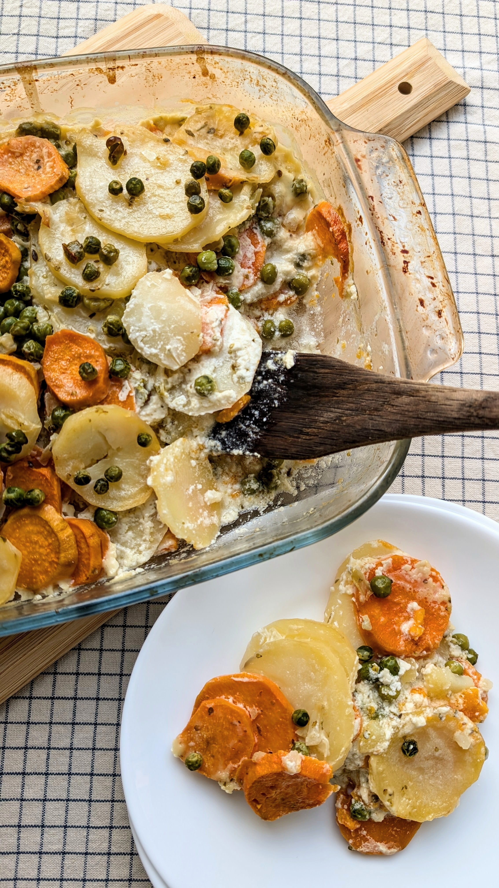

# Orkaitėje keptos bulvės su kokosų pienu ir žaliaisiais žirneliais

Šiandien serviruojame jaukų ir sušildantį orkaitėje keptų bulvių ir batatų patiekalą, kuris yra puikus įrodymas, kad ypatingą ir naują skonį gali sukurti vos keli paprasti ir kasdieniški ingredientai.

## Jums reikės

* 500 g bulvių 
* 500 g saldžiųjų bulvių (batatų)
* 1 vnt. svogūno 
* 2 vnt. česnako skiltelių 
* 500 ml kokosų pieno (galima keisti augalinės sudėties grietinėle)
* 30 g augalinio sviesto (ir papildomai kepimo formos padengimui)
* 100 g šaldytų žaliųjų žirnelių
* 1 a š. druskos 
* 2 a.š. raudonėlio
  
## Paruošimas

1. Įkaitiname orkaitę iki 170°C. Kepimo formą ištepame augaliniu sviestu. 
2. Keptuvėje išlydome augalinį sviestą ir sudedame smulkiai supjaustytą svogūną. Apkepame maišant iki kol svogūnai šiek tiek suminkštės (maždaug apie 3 min.). Tuomet įspaudžiame česnako ir pakepame dar minutę.
3. Supilame į keptuvę kokosų pieną, dedame druską, raudonėlius, viską išmaišome. Į keptuvę sudedame plonais griežinėliais supjaustytas bulves. Kokosų pienui švelniai verdant, bulves troškiname apie 6 min. Tuomet į keptuvę sudedame ir saldžiąsias bulves (batatus). Viską gerai išmaišome ir perkeliame į paruoštą kepimo indą.
4. Kepame orkaitėje apie 1 val., kol bulvės iškepa ir suminkštėja. Kepimui maždaug įpusėjus, į kepimo indą sudedame žaliuosius žirnelius. 

Skanaus šventinio laukimo ir jaukios Kalėdinio filmo peržiūros :)

P.S. Primename, kad paspaudus ant vainiko su dienos filmo rekomendacija galite pasižiūrėti rekomenduojamo filmo trailer'į. :)

