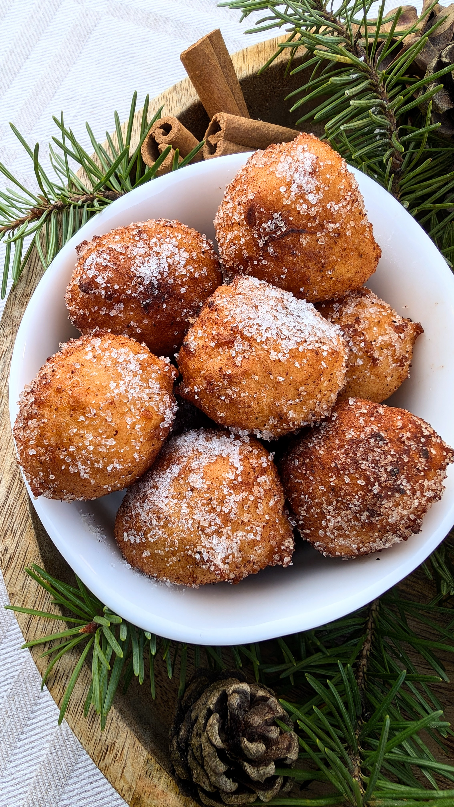

# Spurgytės

Saldžios, cukrumi ir cinamonu pabarstytos spurgytės - tai dar viena švenčių klasika, kuri tokia pasiilgta visų veganų. Jos taip puikiai tinka kartu su garuojančia, karšta kakava! Sunku atsispirti. 

Tešlos paruošimas tikrai greitas ir nesudėtingas. Svarbiausia spurgytes daryti nedideles ir skirti pakankamai laiko joms iškepti, kad ne tik išorėje apskrustų, bet ir viduje tinkamai iškeptų. Bet su trupučiu praktikos viskas pavyks! Bandom! :)

## Jums reikės

* 550 g miltų 
* 240 g sojos jogurto
* 340 g silken tofu
* 150 g cukraus
* 2 v.š. vanilinio cukraus
* 1 vid. dydžio citrinos sulčių (~94 g)
* 2 a.š. kepimo miltelių 
* Aliejaus spurgų kepimui 
* Cinamono, cukraus arba cukraus pudros (spurgyčių padengimui, pabarstymui) 

## Paruošimo eiga

1. Inde suplakame silken tofu su sojos jogurtu ir citrinos sultimis. 
2. Į indą supilame miltus, cukrų ir kepimo miltelius. Įdedame vanilinio cukraus. Išmaišome tešlą šaukštu. (jei tešla gautųsi skystoka, galima papildomai pridėti šiek tiek miltų).
3. Įkaitiname aliejų, tačiau aliejaus neperkaitinkite, kadangi esant per stipriai įkaitintam aliejui spurgytės per greitai apskrus, o vidus liks neiškepęs. Rekomenduojama naudoto virtuvinį termometrą. Aliejaus temperatūra turėtų būti ne didesnė nei 180°C.
4. Formuojame mažas spurgytes, aliejumi suvilgytomis rankomis, ir atsargiai dedame į aliejų. Verdame aliejuje, vis pavartant, kad apskrustų iš visų pusių. Kepimo laikas priklausys nuo jūsų spurgyčių dydžio ir aliejaus temperatūros. Tačiau kiekvienai pusei apkepti turėtų reikėti apie 3 min.
5. Išimame su kiaurasamčiu arba naudojant dvi šakutes ir dedame ant virtuvinio rankšluosčio, kad šiek tiek sugertų aliejaus perteklių.
6. Nedideliame inde pasiruošiame cinamono ir cukraus mišinį (cinamono į cukrų dedame pagal savo pomėgį; rekomenduojama proporcija: maždaug 100 g cukraus ir 1 v.š. cinamono) ir jame pavartome jau šiek tiek atvėsusias spurgytes. Spurgytes galima pabarstyti ir cukraus pudra. 

Skanaus!

