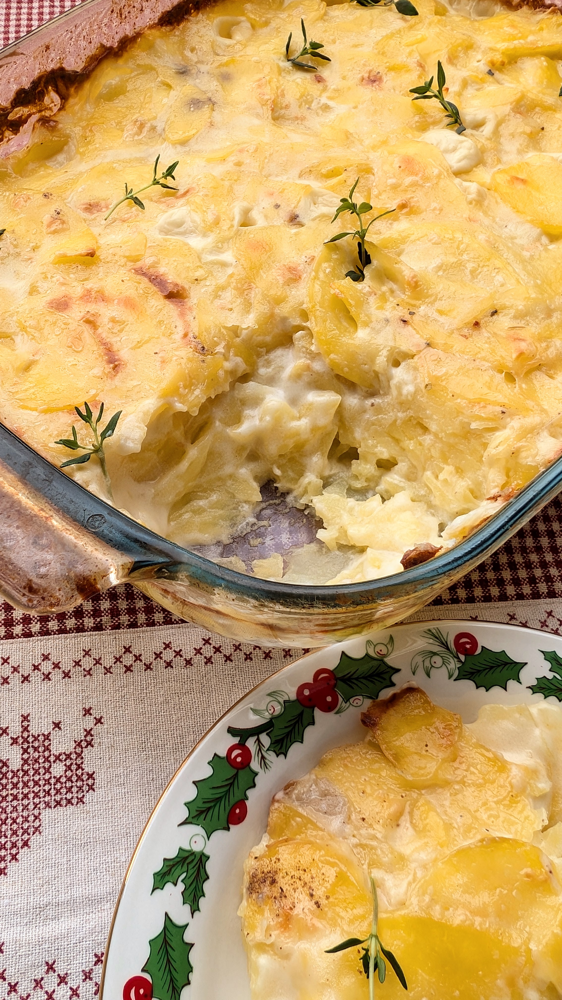

# Bulvių gratinas Dauphinois (Prancūzija)

Prancūzijoje Kalėdos švenčiamos su dideliu atsidavimu šeimos tradicijoms, artimųjų susibūrimui ir laikui kartu, o Kūčių (*Le Réveillon*) vakarienė kasmet yra įspūdinga gastronominė šventė. 

Prancūzijoje Kalėdų vaišės (*Le Repas de Noël*) - šventiškos ir įmantrios, įprastai, tai prabangi, kelių patiekalų vakarienė. Pagrindinis valgis valgomas per Kūčias, laukiant Kalėdų senelio (*Père Noël*) apsilankymo. 

Prancūzams maistas ne mažiau šventas nei pati šventinė Kūčių diena. Šventiniam meniu teikiama daug daugiau dėmesio nei dovanoms, ar namų dekoracijoms. Prieš šventes prancūzai yra linkę paišlaidauti ir svečius lepina prabangiais, aukštos kokybės maisto produktais. 

Kūčių vakarienė prasideda nuo tradicinio *Apéro* - svetainėje svečiai vaišinami nedideliais užkandžiais ir Šampanu, po kurio visi susirenka valgomajame prie ištaigingo šventinio stalo. Šventiniame meniu įprastai būna austrės, rūkyta lašiša, keptas kalakutas su keptais kaštonais, kepta žąsis ir *Foie gras* su figų džemu ir brioche (sviestine duonele). *Foie gras* tai prabangus riebių kepenėlių delikatesas, gaminamas iš specialiai auginant peršertų žąsų ar ančių kepenų. Šis produktas yra prieštaringai vertinamas dėl etikos problemų, gyvūnų gerovės susijusios su priverstiniu gyvūno peršerimu, kai paukščiui metaliniu vamzdeliu nuolat per prievartą kišamas maistas ir jis suvalgo žymiai daugiau maisto nei sulestų natūraliai. Žiauru be diskusijų ir kai kuriose šalyse jau uždrausta. Taip pat ir Prancūzijoje nuo 2008 m. buvo susikūrisi iniciatyvinė grupė "STOP GAVAGE" (Stop peršerimui), kuri vėliau tavo didžiausia šios šalies gyvūnų teisių gynimo organizacija "L214".

Kūčių vakarienė įprastai baigiasi jau po vidurnakčio, visiems apsikeičiant dovanomis. O šventiniam desertui įprastai valgomas šokoladinis biskvitinis tortas su kremu viduje, kurio forma ir dekoras vaizduoja medžio rąstą - *Bûche de Noël*. 

Bulvių gratinas Dauphinois yra klasikinis prancūzų virtuvės patiekalas, kuris ypač mėgstamas žiemos sezonu ir dažnai patiekiamas kaip garnyras Kūčių vakarienės metu. Nors pagal tradicinį receptą patiekalas ruošiamas su pienu ir grietinėle, jis visai nesunkiai veganizuojamas. Patikėkit, bus sunku atsispirti švelniai, kreminei plonai pjaustytų bulvių tekstūrai, o dar ta skaniai apskrudusi plutelė paviršiuje... Dauphinois yra puikus įrodymas, kad prancūziški patiekalai nebūtinai sudėtingi, o vos keli paprasti ingredientai gali sukurti įspūdingą skonį, vertą vietos ant prabangaus prancūzų Kūčių stalo. 

## Jums reikės

* 1,5 kg bulvių 
* 250 ml 24% riebumo kokosų pieno
* 400 ml kokosų pieno
* 0,5 a. š. malto muskato
* 1 vnt. česnako skiltelės
* Druskos ir juodųjų pipirų pagal skonį
* Aliejaus kepimui
* Šviežių čiobrelių (Nebūtina. Nors klasikiniame recepte neįtraukti, bet visgi jie čia puikiai tinka, galima naudoti tik kaip papuošimą patiekalo paviršiuje)

## Paruošimo eiga

1. Nuskutame bulves ir supjaustome, ar sutarkuojame plonais, apvaliais griežinėliais. Bulvių griežinėlių neplauname, kad liktų kuo daugiau krakmolo.
2. Bulvių griežinėlius iškart perkeliame į puodą su kokosų pienu (maišome įprastą kokosų pieną su riebiu). Įdedame maltų muskatų ir druskos, bei juodųjų pipirų pagal skonį. Bulves troškiname vis pamaišant apie 15 min., kol jos šiek tiek suminkštėja. 
3. Įkaitiname orkaitę iki 180°C. Paruošiame kepimo indą - ištepame trupučiu aliejaus kepimo indo dugną. Kepimo indo dugną ir kraštus įtriname per pusę perpjauta česnako skiltele. 
4. Perkeliame į kepimo indą troškintas bulves, mentele sulyginame paviršių ir kepame orkaitėje, indą uždengus folija apie 30 min., tuomet atidengiame, ir kepame dar 30 min. Pabaigoje keletą minučių gratiną pakepame su orkaitėje įjungta grilio funkcija, kad paviršius dar skaniau apskrustų ir vietomis, švelniai paruduotų. 

Skanaus!

