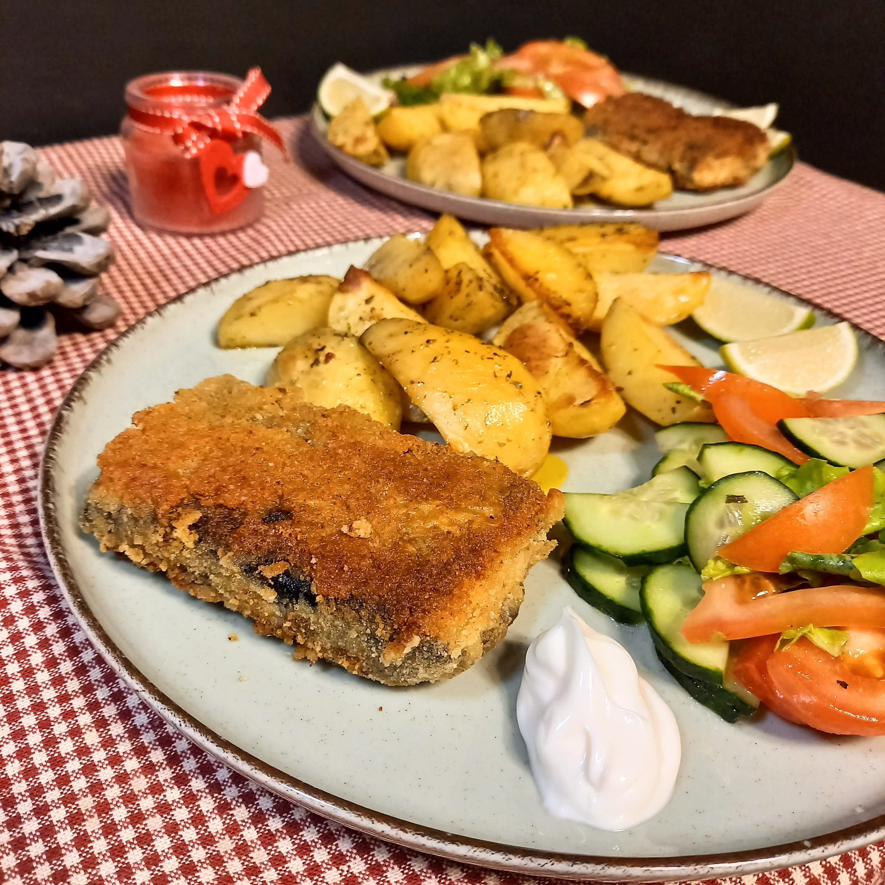

# Keptas tofu su jūros dumbliais tešloje

Tofu įvyniotas į Nori lapus ir keptas tešloje - tai itin gardus kepsnys, puikiai tinkantis šventėms ir lengvai derinamas su įvairiausiais skirtingais garnyrais. Dėl paruošimui naudojamų jūros dumblių, šis patiekalas savo skoniu subtiliai primena žuvies kepsnelius. 😊

## Jums reikės

* 400 g tofu
* Džiovintų jūros dumblių, Nori lapų
* 150 g nealkoholinio alaus
* 100 g miltų
* 2 skiltelių česnako
* 2 šaukštų aliejaus
* Žiupsnelio druskos
* Žolinių prieskonių žuvies patiekalams
* Džiuvesėlių

## Paruošimas

1. Pasiruošiame tešlą. Sumaišome miltus su nealkoholiniu alumi, prieskoniais, druska, aliejumi ir įspaudžiame dvi skilteles česnako.
2. Kiekvieną tofu gabalėlį (200 g) perpjauname išilgai į dvi vienodas dalis. Tofu paplotėlius iš abiejų pusių ištepame trupučiu aliejaus, uždedame iš abiejų pusių Nori jūros dumblių lapus.
3. Tofu paplotėlius, prilaikant jūros dumblių lapus, panardiname į tešlą, kad apsemtų iš abiejų pusių ir dedame į lėkštę su džiuvesėliais. Džiuvesėliais padengiame visą paplotėlį iš visų pusių, taip pat ir paplotėlio kraštus.
4. Kepame tofu įkaitintoje keptuvėje su aliejumi, apkepame tofu iš abiejų pusių.

Skanaus šventinio laukimo!

