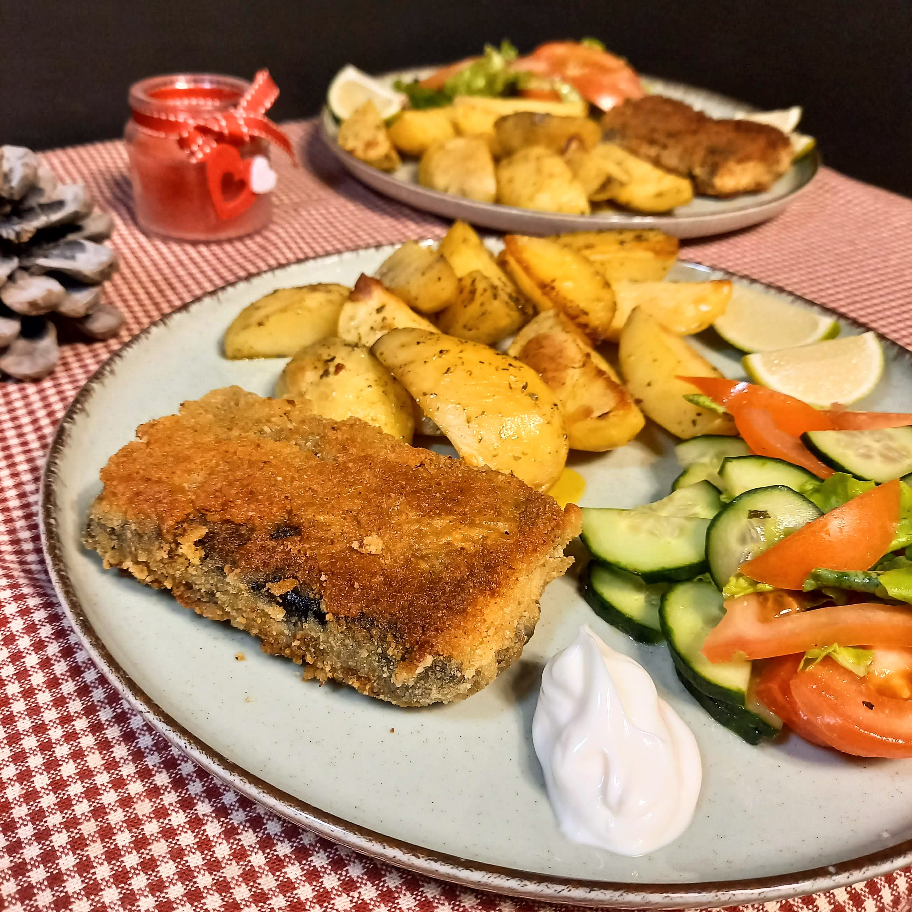

# Falafeliai

Vis dar svarstote, kokį pagrindinį patiekalą ruošti šventėms? O kodėl gi neiškepus visų mėgstamų falafelių? Skanu, maistinga ir greitai paruošiama. 

Dalinamės, kaip falafelius gaminame savo namuose. Man šis receptas patinka tuo, kad falafeliai gaunasi minkšti, drėgni, tačiau nepaisant to, gerai išlaiko savo formą. Pagal šį receptą gaunasi apie 10 vnt. falafelių.

## Jums reikės

* 500 g konservuotų avinžirnių 
* 2 v.š. sezamo pastos (Tahini)
* 2 vnt. česnako skiltelių 
* 4 v.š. alyvuogių aliejaus 
* 1 a.š. kumino
* 1 a.š. saldžiosios paprikos
* 30 ml vandens
* 25 g miltų
* Žiupsnelio druskos
* Mėgstamų žolinių prieskonių (puikiai tinka Viduržemio jūros prieskonių mišinys, Provanso žolelės ar tiesiog krapai)
* Džiuvesėlių

## Paruošimas

1. Į indą sudedame konservuotus avinžirnius (prieš tai nuo jų nupylus skystį). Dedame Tahini, įspaudžiame česnako skilteles, dedame prieskonius, Įpilame aliejaus ir šlakelį vandens. Viską sutriname su virtuviniu mikseriu. 
2. Įdedame miltų ir permaišome viską šaukštu.
3. Formuojame falafelius ir juos apvoliojame džiuvesėliuose. 
4. Falafelius kepame įkaitintoje keptuvėje su aliejumi. Keptuvės su dangčiu neuždengiame! Apkepame falafelius iš abiejų pusių, kol gražiai apskrunda. 
5. Patiekiame su šviežiomis salotomis ar kitu mėgstamu garnyru. Tinka valgyti su Tadziki ar pomidorų padažu, kartu su humusu. 

Skanaus šventinio laukimo!

