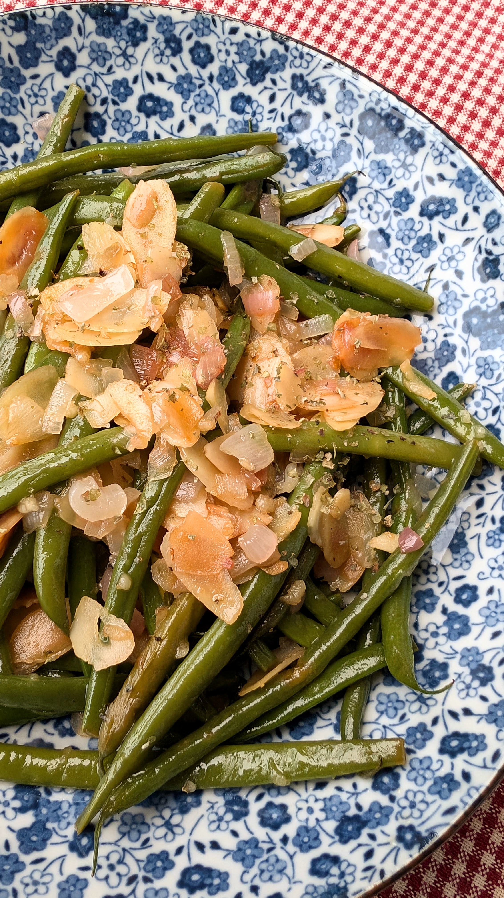

# Žaliosios pupelės su migdolais (Prancūzija)

Prancūzijoje visų laukiamiausias švenčių svečias yra *Père Noël* (tariamas kaip pehr noh-EL), kartais vadinamas dar *Papa Noël* ir iš prancūzų kalbos verčiamas kaip Kalėdų tėtis. Vaikai *Père Noël* rašo laiškus su savo kalėdinių norų sąrašu ir VISI gauna atsakymą! Ši miela tradicija ir kartu rimtas pašto įsipareigojimas gyvuoja nuo 1962 metų. Kasmet tūkstančiai savanoriaujančių pašto darbuotojų kalėdiniu laikotarpiu atsakinėja į vaikų laiškus. Tikras Kalėdų stebuklas. :) 

Kūčių vakarą vaikai prie židinio ar po eglute palieka savo batus ir šlepetes, tikėdamiesi, kad *Père Noël* per naktį pripildys jas dovanomis. Dalis šeimų stato dekoratyvinius, kalėdinius batus (*la botte de Noël*) arba kabina dekoratyvines kalėdines kojines (*la chaussette de Noël*) dovanoms sudėti. Dažnai prie batų paliekama ir morkų *Père Noël* asiliukui. 

Per Kūčias šeimos susirenka jaukios prabangios vakarienės, eina į mišias bažnyčioje, o Kalėdų dieną įprastai lanko giminaičius, senelius. Gruodžio 26 diena (antroji Kalėdų diena) Prancūzijoje nėra šventinis laisvadienis ir visi gerokai pavargę ir persivalgę grįžta į darbus. 

Jei norėtumėte prancūziškai palinkėti linksmų Kalėdų, sakykite - *Joyeux Noël* (sėkmės su tarimu :D).

## Jums reikės

* 150 g žaliųjų pupelių
* 30 g migdolų riekelių 
* 20 g augalinio sviesto
* 1 vnt. Shalot svogūno
* 2 vnt. česnako skiltelių
* ~ 1/3 citrinos
* Druskos ir juodųjų pipirų

## Paruošimas

1. Puode užverdame vandenį ir pasūdome. Sudedame žaliasias pupeles ir pavardame keletą minučių.
2. Į keptuvę dedame sviestą ir ištirpiname. Sviestui ištirpus jis pradės putoti, pakaitiname jį dar apie 3 minutes ir sudedame migdolų riekeles. Apkepame maišant ant nedidelės kaitros, apie 3 minutes, kol jos lengvai paruduoja. 
3. Sudedame į keptuvę kubeliais supjaustytą Shalot svogūną ir įspaudžiame česnako. Apkepame maišant, kol svogūnai suminkštėja. 
4. Į keptuvę perkeliame apvirtas pupeles ir sumaišome. Įtarkuojame šiek tiek citrinos žievelės ir įspaudžiame citrinos sulčių. Įdedame druskos ir pipirų pagal skonį. 

Skanaus šventinio laukimo!

