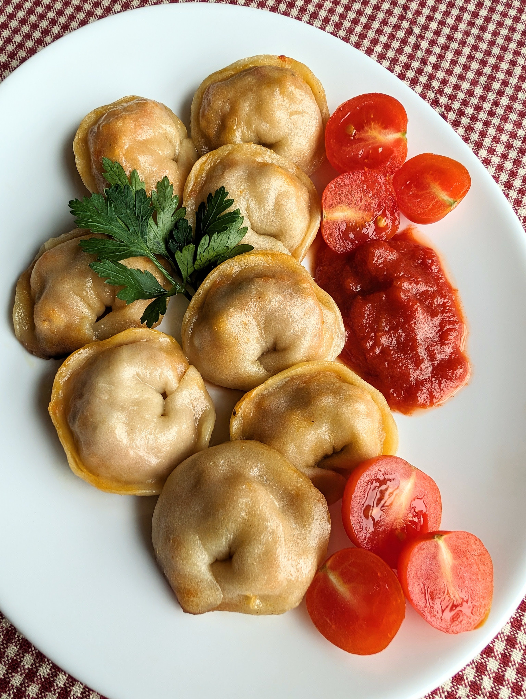

# Koldūnai su tofu

Koldūnai, tai vienas iš tradicinių Kūčių vakarienės patiekalų. Šiandien dalinamės mūsų mėgstamiausiu koldūnų receptu ir gal kiek netradiciniu, bet mums labai patinkančiu, jų paruošimu - trumpai apkepant ir troškinant keptuvėje. 😊

## Jums reikės

### Koldūnų tešlai:

* 300 g miltų
* 170 ml karšto vandens
* ~0,5 a.š. druskos

### Įdarui:

* 400 g tofu
* Vienos morkos
* Vieno nedidelio svogūno
* 3 skiltelių česnako
* 3 v.š. pomidorų padažo
* 1 a.š. rūkytos paprikos
* Viduržemio prieskonių
* Žiupsnis druskos ir pipirų

## Paruošimas

1. Pradedame nuo tešlos paruošimo: 300 g miltų maišome su 0,5 šaukštelio druskos ir 170 g karšto vandens. Tešlą minkome ~ 5 min rankomis ir 30 min palaikome šaldytuve. Kol tešla šaldytuve, ruošiame įdarą.
2. Apkepame keptuvėje su aliejumi supjaustytą svogūną ir smulkiai sutarkuotą morką. Įspaudžiame porą skiltelių česnako ir į keptuvę dedame kartu apkepti 400 g tofu (tofu dedame į keptuvę sutrinant jį rankomis iki smulkių gabalėlių). 
3. Įdedame 3 v.š. pomidorų padažo, 1 a.š. rūkytos paprikos, dedame druskos, pipirų ir Viduržemio prieskonių mišinio pagal skonį. Viską gerai išmaišome ir troškiname.
4. Kočiojame tešlą. Su apverstu puodeliu ar stikline įspaudžiame apvalias formeles tešloje. Šaukšteliu dedame įdarą ir lipdome kodūnus. 
5. Keptuvėje įkaitiname aliejų ir sudėję koldūnus pakepame 2 min, kol gražiai apskrunda apačia. Tuomet įpilame 1/4 puodelio vandens ir uždengę keptuvę dangčiu troškiname koldūnus 10 min.
Skanaus šventinio laukimo!

