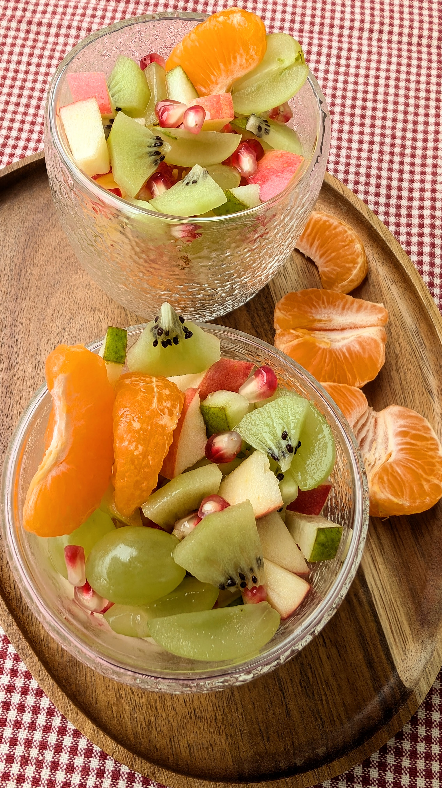

# Vaisių salotos (Prancūzija)

Prancūzijos Provanso regione Kūčios turi ypatingą ir išskirtinę tradiciją - trylika desertų, simbolizuojančių Jezų ir dvylika apaštalų. Gal reiktų šią tradiciją išpopuliarinti ir Lietuvoje? :D Dvylika patiekalų ir trylika desertų, va čia tai Kūčios!

Visgi tradiciniai Kūčių desertai čia paprastesni, nei jau turbūt spėjote prifantazuoti, bet kaip jau prancūzams būdinga, net iš pirmo žvilgsnio paprastai atrodantys patiekalai yra gurmaniški ir pagaminti su kokybiškais ingredientais. 

Taigi, į desertų asortimentą dažniausiai įeina, bet nebūtinai jais apsiriboja: baltoji ir juodoji nuga, džiovintos figos, datulės, džiovinti ir cukruoti vaisiai, migdolai ir graikiniai riešutai, *Gibassier* (duona su anyžiumi, apelsinų žiedų vandeniu, apelsinų cukruotomis žievelėmis ir pabarstyta cukrumi), *Calissons d'Aix* (prancūziški saldainiai iš vienalytės cukruotų vaisių ir migdolų pastos su prabangiu glajaus sluoksniu) ir tradicinis Prancūzijos Provanso Kalėdinis desertas - *Pompe à l'huile*, saldi duonelė ruošiama su alyvuogių aliejumi, apelsinų vandeniu ir citrusų žievele.

Sočią Kūčių vakarienę gali puikiai užbaigti ir gaivios vaisių salotos. Skirtingų tekstūrų, spalvingi ir sezoniai vaisiai sukuria gardų desertą, kuriam papildomo saldumo galima suteikti apšlakstant trupučiu klevų sirupo. O traškūs riešutų gabaliukai gali dar labiau išryškinti deserto tekstūriškumą ir pagilinti skonius. Konkretaus ir griežto recepto vaisių salotoms nėra, galima drąsiai žaisti su sezoniniais vaisiais: obuoliai, apelsinai, mandarinai, persimonai, kiviais, mangais ir t.t...

## Jums reikės

* Kriaušių
* Obuolių
* Mandarinų
* Granatų sėklų
* Kivių
* Vynuogių
* Citrinos sulčių (šviežiai įspaustų)
* Klevų sirupo
* Nebūtina, bet puikiai tiktų graikinių riešutų gabaliukai

## Paruošimas

1. Kriaušes ir obuolius perpjauname per pusę, pašaliname sėklas ir supjaustome kubeliais. Iškart apšlakstome citrinų sultimis, kad netamsėtų ir sumaišome. 
2. Nulupame mandarinus ir padaliname skiltelėmis. 
3. Kivius nulupame ir supjaustome kubeliais.
4. Inde maišome vaisių kubelius su vynuogėmis (didesnes perpjaukite per pusę) ir granatų sėklomis. 
5. Sudedame vaisių salotas į stiklines ar desertines, apšlakstome pagal skonį klevų sirupu ir jei norima, pabarstome graikiniais riešutais.
   
Skanaus!

