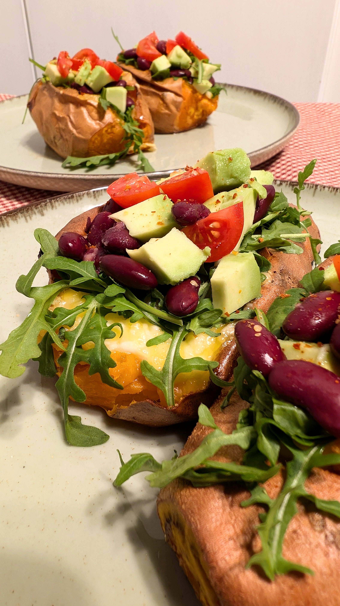

# Orkaitėje keptos įdarytos saldžios bulvės

Čia tai bent receptas! - norisi sušukti. 😊 Žinokit, tikrai nuostabiai skanu! Papildomas pliusas, kad gana nesudėtingai paruošiama,o atrodo ir yra įspūdinga. Tai gali būti patiekiama ir kaip pagridinis patiekalas, ir kaip prašmatnus garnyras. 

## Jums reikės

* 5 vnt. saldžiųjų bulvių (batatų)
* 11 slyvinių pomidoriukų 
* 2 vnt. avokadų 
* 240 g raudonųjų pupelių
* 100 g augalinės sūrio alternatyvos
* Gražgarsčių
* 2 v.š. augalinės sudėties majonezo 
* Augalinio sviesto
* Aliejaus kepimui

## Paruošimas

1. Batatus nuplauname, įpjauname išilgai per vidurį ir apšlakstome aliejumi (batatų žievelės nenuskutame). Dedame kepti į orkaitę, įkaitintą iki 250°C temperatūros. Kepame apie 45 min, kol saldžiosios bulvės viduje tampa minkštos. 
2. Kol kepa bulvės, pasiruošiame kitus ingredientus. Išplauname daržoves ir garžgarstes. Supjaustome kubeliais avokadus ir pomidorus. Sutarkuojame sūrį ir jį sumaišome su 2 v.š. majonezo. 
3. Bulvėms iškepus į jų vidų dedame po gabaliuką augalinio sviesto ir sutriname šakute bulvės vidų (tarsi padarome bulvių košę). Į batatų vidų dedame augalinio sūrio sumaišyto su majonezu ir pakepame orkaitėje dar 10 min. 
4. Tuomet į iškeptų saldžiųjų bulvių vidų dedame gražgarstes, pupeles ir daržoves. Jei norime, ant viršaus pabarstome šiek tiek prieskonių ar čili dribsnių.

Skanaus!

