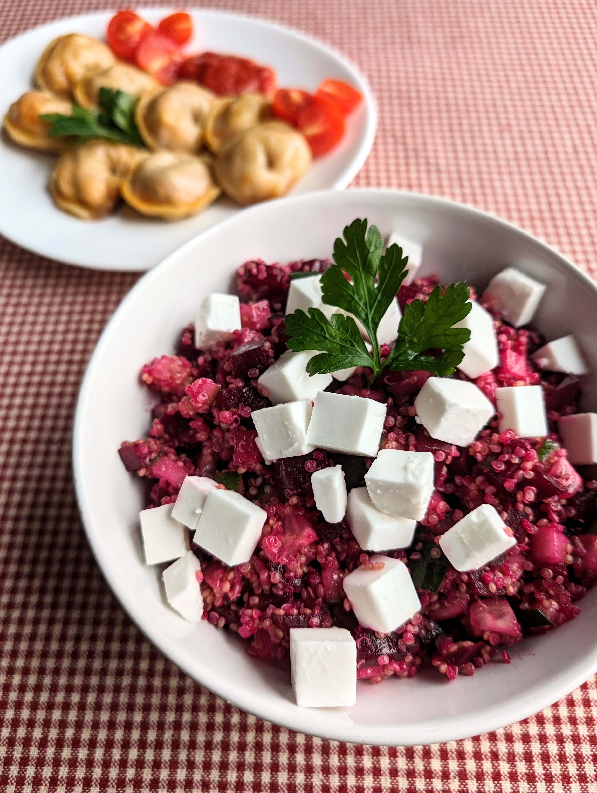

# Burokėlių mišrainė su bolivine balanda

Burokėlių mišrainė Kalėdoms šį kartą kitaip - su bolivinėmis balandomis ir augaliniu "fetos" sūriu. Bolivinės balandos suteikia maistingumo, o mišrainės tekstūrai - gardaus traškumo. Augalinė "feta" tuo tarpu sukuria ne tik originalų, naują skonį, bet kartu teikia ir lengvumo bei gaivumo pojūtį. 😊

## Jums reikės

* 500 g virtų burokėlių
* 150 g bolivinės balandos
* 200 g augalinio, balto sūrio (Graikiško, fetos sūrio alternatyva)
* 1 ilgavaisio agurko
* Alyvuogių aliejaus
* Druskos ir pipirų

## Paruošimas

1. Išverdame bolivines balandas pasūdytame vandenyje. 
2. Virtus burokėlius ir augalinę fetą supjaustome kubeliais. Susmulkiname agurką.
3. Bolivinei balandai atvėsus, maišome visus ingredientus kartu. Pagardiname mišrainę druska ir pipirais, pašlakstome alyvuogių aliejaus.

Skanaus šventinio laukimo!

