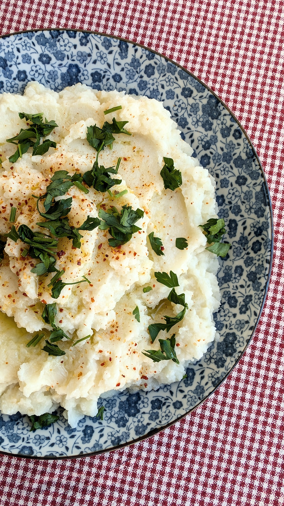

# Žiedinių kopūstų piurė

Švelni, kreminės tekstūros žiedinių kopūstų piurė gali būti puikiu garnyru ant jūsų šventinio stalo, kuri skaniai derės tiek su keptu tofu, tiek su įvairiais daržoviniais paplotėliais, ar falafeliais. Labai skanu, maistinga ir paruošiama lengviau ir greičiau nei tradicinė bulvių košė. :)

## Jums reikės

* 2 vnt. žiedinių kopūstų 
* 3 v.š. alyvuogių aliejaus
* 3-4 vnt. česnako skiltelių (arba pagal skonį)
* 1 skardinė sviestinių pupelių (nebūtina, bet labai tinka)
* ~0.5 stiklinės augalinio gėrimo (naudojome avižų)
* Šviežių petražolių 
* Druskos 
* Čili dribsnių (nebūtina)

## Paruošimas

1. Išverdame žiedinius kopūstus sūdytame vandenyje, kol jie suminkštėja. Nupilame vandenį.
2. Atskirame nedideliame puode pašildome augalinį gėrimą.
3. Į puodą su virtais žiediniais kopūstais įspaudžiame česnako skilteles, įpilame alyvuogių aliejaus ir triname virtuviniu mikseriu vis įpilant po truputį augalinio gėrimo. (Jei naudojate, dėti ir kartu sutrinti sviestines pupeles. Šiame recepte jos nėra būtinas ingredientas, tačiau prideda papildomo skonio ir tirštumo). Augalinio gėrimo pilame trinant košę pagal poreikį, kol gauname švelnios tekstūros ir norimos konsistencijos košę. 
4. Pagal skonį pasūdome.
5. Serviruojame lėkštėje, apšlakstant trupučiu alyvuogių aliejaus ir pabarstant šviežiomis, smulkintomis petražolėmis, bei čili dribsniais.
   
Skanaus šventinio laukimo!

