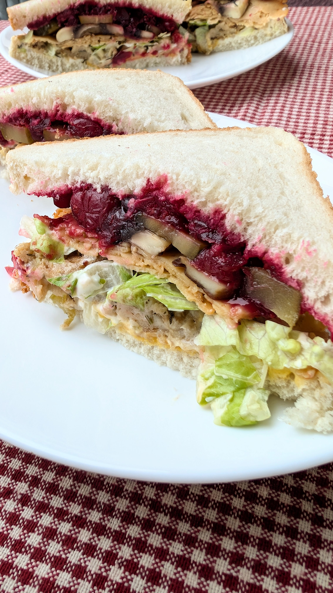

# Kalėdinis sumuštinis (Didžioji Britanija)

Didžiojoje Britanijoje Kalėdos pripildytos sezoninių linksmybių. 

Vaikai laukia Kalėdų *tėvelio* (*Father Christmas*), kuris aplanko vaikus Kūčių naktį. Vietoj stiklinės pieno su sausainiais, vaikai palieka jam gabalėlį pyrago ir taurę alkoholinio gėrimo *sherry* (įdomu kaip jam sekasi po tokios darbingos nakties vairuoti savo roges). 

Kalėdinės dovanos išpakuojamos per Kalėdas ir dažniausiai tik po šventinių Kalėdų pietų. Tačiau smulkios dovanėlės sudėtos į kalėdines kojines įprastai būna išpakuojamos iš pačio ryto.

Kiekvienam svečiui ant Kalėdų stalo padedama po kalėdinį krakerį (*Christmas cracker*). Tai pailgos, popierinės, cilindro formos dėžutės, primenančios saldainį, kurias traukiant už skirtingų galų jos plyšta, o viduje yra dovanėlės: popierinė karūna, maža smulkmenėlė, juokingi pokštai. Svečiai pasipuošia karūnomis, džiaugiasi mažais niekučiais ir skaito prie stalo krakeriuose paslėptus pokštus. Po pietų, įprastai apie 15 val. per televiziją rodoma Karaliaus Kalėdų transliacija, kuri yra labai laukiama ir žiūrima kasmet kartu su visa šeima. 

Ant tradicinio Kalėdų stalo įprastai būna keptas kalakutas su salierų ir svogūnų įdaru (*stuffing*) ir spanguolių padažu. Įdomu, kad vadinamasis *stuffing* gali būti patiekiamas ir atskirai, kaip garnyras. Užkandžiams populiaru ruošti *Pigs in blankets* arba bandeles su dešrelėmis (veganizuotą receptą rasite pirmame "Valgyk daugiau daržovių numeryje"). Desertui ruošiamas Kalėdų pudingas su džiovintais vaisiais ir prieskoniais, kuriame kartais slepiama sidabrinė moneta. Tikima, kad ją radusiam žmogui šypsosis sėkmė. Taip pat šventiniu laikotarpiu labai populiarūs *Mince pies* - pyragai su džiovintų, brendyje mirkytų vaisių įdaru. 

Na, ir vienas unikaliausių britiško Kalėdinio laikotarpio akcentų - Kalėdiniai sumuštiniai. Vos tik prasidėjus šventiniam sezonui, prekybos centrai, kavinės ir restoranai į savo asortimentą įtraukia specialiai Kalėdiniam laikotarpiui sukurtus sumuštinius. Jų populiarumas yra toks didelis, kad kasmet Londone vyksta net Kalėdinių sumuštinių festivalis (*Christmas Sandwich Festival*).

Kalėdinio sumuštinio idėja - tarp dviejų riekelių šviesos duonos sudėti tai, kas primena šventinį stalą ir nostalgiškai dvelkia Kalėdomis namuose. Tradiciškai sumuštinyje būna kalakutiena, *stuffing* ir spanguolių padažas, tačiau pasiūla labai įvairi. Be tradicinių sumuštinių galite rasti ir vadinamųjų *wrap* suktinukų tortilijoje, ir sumuštinių ant skirtingų rūšių duonos - ciabatta, focaccia ir t.t., o kur dar sumuštinio viduje esančių ingredientų derinių įvairovė. Didžiojoje Britanijoje netrūksta pasirinkimo ir veganams. Tad kasmet britai su nekantrumu laukia prekyboje pasirodančių specialiai šiam sezonui sukurtų naujienų.

## Sumuštiniams reikės

* Šviesios, sumuštinių duonos 
* Augalinės sudėties majonezo
* Garstyčių
* ~250 g pievagrybių
* Marinuotų agurkėlių
* Romano salotos
* 180 g augalinės vištienos arba kalakuto alternatyvos (Galima keisti ir rūkytu tofu)

## Svogūnų ir salierų įdarui (stuffing) reikės

* 200 g šviesios sumuštinių duonos
* 1 vnt. didelio svogūno
* 60 g salierų
* Aliejaus kepimui
* 3 vnt. česnako skiltelių
* Šviežių krapų ir rozmarinų
* 0,5 vnt. kubelio daržovių sultinio
* Druskos ir juodųjų pipirų pagal skonį

## Spanguolių padažui reikės

* 400 g šaldytų spanguolių
* 150 ml apelsinų sulčių
* 50 ml vandens
* 100 g cukraus

## Paruošimas

Ruošiame stuffing.

1. Duoną suplėšome rankome į gabaliukus ir dedame į mikserį, sutriname iki trupinių. 
2. Įkaitiname orkaitę iki 180°C. Pasiruošiame kepimo formą, ją ištepame aliejumi.
3. Keptuvėje įkaitiname aliejų ir jame apkepame kubeliais supjaustytą svogūną ir salierą, kol jie suminkštėja (~8-10 min.). Įspaudžiame česnako, apkepame apie minutę. Tuomet sudedame susmulkintus šviežius prieskonius (rozmarinus ir krapus) ir įpilame daržovių sultinį (daržovių sultinį pasiruošiame puodelyje užpylus karštu, virintu vandeniu pusę kubelio sultinio ir išmaišius).
4. Pasiruoštą salierų ir svogūnų mišinį užpilame ant duonos trupinių. Išmaišome.
5. Duonos trupinius su svogūnais ir salierais perkeliame į pasiruoštą kepimo indą ir kepame orkaitėje apie 30 min. 

Ruošiame spanguolių padažą.

1. Nedideliame puode sumaišome vandenį su sultimis ir cukrumi. Užverdame ir pakaitiname, kol ištirpsta cukrus. 
2. Suberiame šaldytas spanguoles ir užverdame mišinį. 
3. Verdame ant vidutinės kaitros vis pamaišant, kol spanguolės pradeda byrėti, o padažas šiek tiek sutirštėja (jis papildomai sutirštėja ir jam atvėsus). 
4. Padažą paliekame atvėsti (ant Kalėdinio stalo jis patiekiamas pilnai atvėsintas).

Sumuštinių paruošimas.

1. Pievagrybius nulupame, supjaustome griežinėliais ir apkepame keptuvėje su trupučiu aliejaus.
2. Supjaustome griežinėliais agurkėlius ir susmulkiname Romano salotas.
3. Pasiruošiame duonos riekeles. Ant vienos sumuštinio riekelės tepame augalinio majonezo ir garstyčių. Ant viršutinės sumuštinio riekelės tepame tik spanguolių padažo.
4. Ant riekelės su majonezu ir garstyčiomis tepame pasiruoštą *stuffing* ir dedame pjaustytas Romano salotas, agurkėlių griežinėlius, augalinės vištienos/kalakutienos alternatyvos griežinėlius (galima naudoti ir juostelėmis supjaustytą tofu) ir keptus pievagrybius. Ant viršaus uždedame duonos riekelę su spanguolių padažu.

Skanaus!

