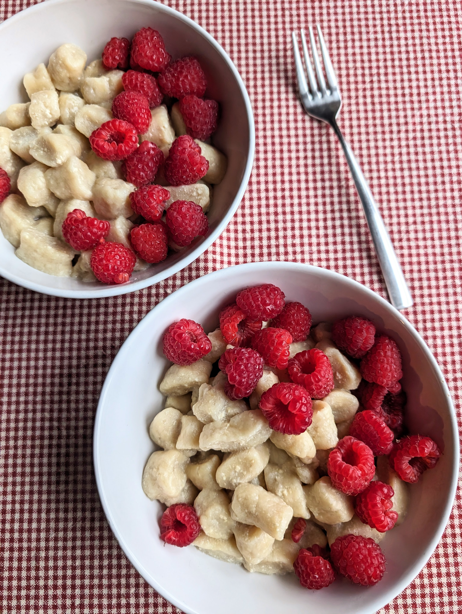

# Virti "varškėtukai" iš tofu (tofinukai)

Virti "varškėtukai", manau, daugeliui kelia malonius, nostalgiškus prisiminimus. Tai puikus, skanus patiekalas jaukiems pusryčiams su šeima, o be to ir maistingas! Šį kartą dalinamės augaline patiekalo alternatyva, nesudėtingai paruošiama iš tofu. 😊

## Jums reikės

* 400 g tofu
* 120 g kvietinių miltų
* 100 g cukraus
* 3 v.š. krakmolo ištirpinto 4 v.š. vandens
* Žiupsnelio druskos

## Paruošimas

1. Tofu nusausiname įsukdami į švarų rankšluostį ir šiek tiek jį paspaudžiant.
2. Į indą dedame rankomis susmulkintą tofu (triname tarp pirštų, kad subyrėtų į smulkius gabalėlius), dedame cukrų ir supilame krakmolą ištirpintą vandenyje. Viską sutriname virtuviniu mikseriu. 
3. Į trinto tofu masę beriame miltus ir išminkome rankomis. 
4. Ant pjaustymo lentelės paberiame miltų ir formuojam "varškėtukų" juosteles ir supjaustome vienodo dydžio gabalėliais.
5. Tofinukus dedame į verdantį, pasūdytą vandenį ir jiems iškilus į paviršių verdame 10 min
6. Valgome su mėgstamais priedais: augaline grietinėle, lydytu augaliniu sviestu, jei mėgstame - pasibarstome papildomai cukrumi, ar pagardiname uogiene. Puikiai tinka ir šviežios uogos!

Skanaus šventinio laukimo!

