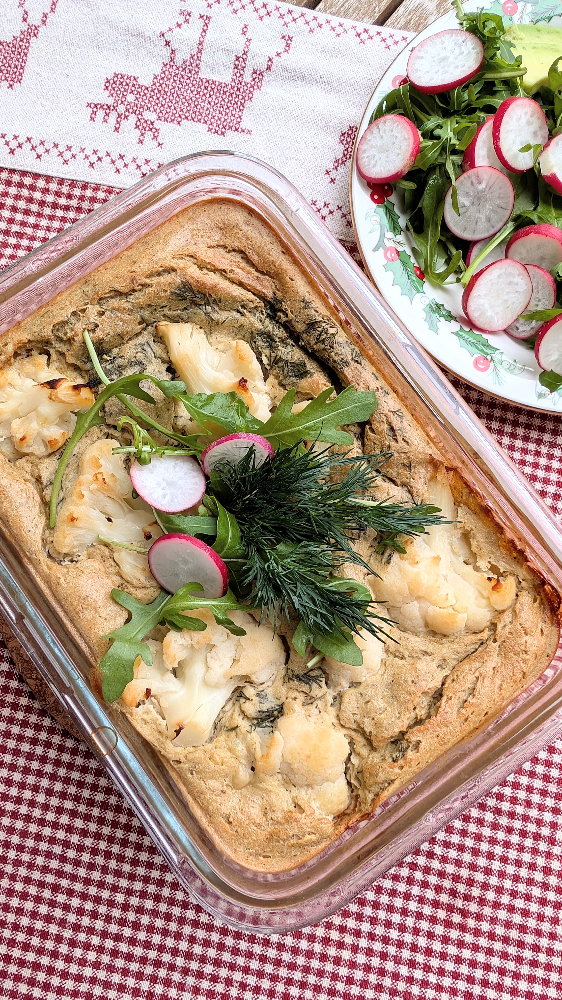

# Pusryčių idėja: fritata su žiediniais kopūstais ir krapais

Ar galite patikėti, kad jau šiandien vakare visi sėsime prie Kūčių stalo? Kaip greitai bėga laikas, tiesa? Ir atrodo, kad kasmet laukiamos žiemos šventės ateina vis greičiau.

Linkiu jums šį vakarą sustoti, pasimėgauti akimirkomis niekur neskubant. Ramybės ir jaukumo artimiausių žmonių rate. Šiltų pokalbių, malonių susitikimų. :) 

Tikiu, kad šventiniams stalams jau turite daug idėjų, tad šiandien dalinuosi su jumis pusryčių receptu. Tai orkaitėje kepta fritata su žiediniais kopūstais ir krapais. Nesunkiai paruošiama ir maistinga. 😊

## Jums reikės (2 porcijoms; kiekis matomas nuotraukoje)

* 580 g silken tofu 
* Dviejų saujų anakardžių
* Saujos šviežių krapų 
* 2 vnt. česnako skiltelių 
* 0,5 v.š. ryžių acto
* 1 v.š. kukurūzų krakmolo
* 1 a.š. ciberžolės
* 0,5 a.š. druskos (jei norite suteikti į omletą dar panašesnį skonį, rinkitės juodąją druską)
* 1 v.š. bazilikų 
* Žiupsnelio penkių pipirų mišinio 
* 1/3 žiedinio kopūsto

## Paruošimas

1. Į virtuvinį trintuvą dedame silken tofu, įpilame ryžių acto, įspaudžiame česnako, sudedame prieskonius, druską ir pipirus. Ir viską sutriname. 
2. Dedame anakardžius (jei jūsų trintuvas nėra galingas anakardžius prieš tai pamirkykite bent porą valandų arba per naktį). Viską sutriname trintuvu iki vientisos masės. 
2. Šaukštu įmaišome šviežių, smulkintų krapų. 
3. Paruoštą masę pilame į kepimo formą.
4. Sudedame žiedinių kopūstų žiedynus.
5. Kepame orkaitėje, įkaitintoje iki 200°C temperatūros, apie 1 val. 
6. Patiekiame kartu su šviežiomis daržovėmis ar salotomis.

Skanaus!

