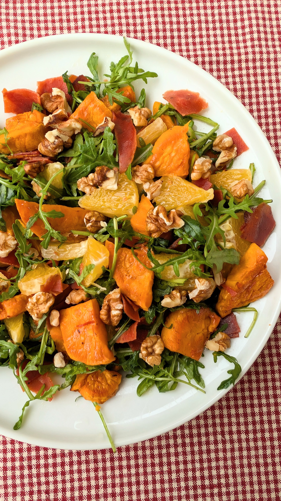

# Saldžiųjų bulvių salotos (Naujoji Zelandija)

Naujojoje Zelandijoje Gruodžio 25 d. taip pat švenčiamos Kalėdos (Māori kalba: *Kirihimete*), tačiau šiuo laikotarpiu čia yra vasaros sezonas su šiltais ir saulėtais orais, ir nuo Gruodžio vidurio prasidedančiomis mokinių vasaros atostogomis. N. Zelandijos gyventojams Kalėdos yra svarbiausias laikas metuose, orientuotas į buvimą kartu su šeima, todėl daug verslų šiuo laikotarpiu nedirba, o didelė dalis gyventojų išeina kasmetinių atostogų porai savaičių.

N. Zelandijoje iki šiol gyvuoja daug britiškų Kalėdų šventimo tradicijų, tam tarpe ir jų kalėdiniai patiekalai. Nors tradiciškai šventinė Kalėdų vakarienė valgoma namuose, N. Zelandijoje kasmet vis labiau populiarėja Kalėdų šventimas lauke su išvykomis į paplūdimį, piknikais ir BBQ griliumi. Kalėdiniuose patiekaluose gausu vasaros sezoninių vaisių ir daržovių, ruošiama daug skirtingų salotų. Desertui dažnai patiekiami tradiciniai britiški desertai, tokie kaip Kalėdų pudingas ar *Mince* *pie*, kartu su vietiniais saldėsiais, tokiais kaip pavlova su sezoniniais vaisiais ir uogomis (dažnai braškėmis, avietėmis ir kiviais).

Gruodžio mėnesį dideliais, raudonais žiedais pražysta *pōhutukawa* augalas, kuris Naujojoje Zelandijoje yra laikomas Kalėdų simboliu, visai kaip pas mus kalėdų eglutė. Tačiau kaip mums įprasta, šiemos namuose puošia eglutes (puošiamos tiek gyvos, tiek dirbtinės eglutės), po kuriomis Kalėdų senelis įprastai palieka įvairių vasaros lauko žaidimų ir sporto atributikos, pavyzdžiui, vandens šautuvus, plaukimo lentas vaikams ir pan.

Kalėdų simbolika ir dekoras N. Zelandijoje yra mišrus. Čia maišosi vietinės augmenijos motyvai su mums pažįstamais Kalėdų simboliais: elfais, Kalėdų seneliu ir prakartėle. Ant kalėdinių atvirukų gali pamatyti ir saulėtą paplūdimį, ir Kalėdų senelį, ar net snaigių. Dalis vietinių gyventojų mėgsta pasipuošti namus lemputėmis ir kitomis dekoracijomis. Panašiai kaip Amerikoje, daliai N. Zelandijos vietovių būdingas pompastiškas namų dekoras su dideliu kiekiu lempučių ir dekoracijų, tampant vietinių ir turistų lankyta vieta. 

## Salotoms reikės

* 1 vnt. saldžios bulvės
* 1-2 a. š. klevų sirupo
* Alyvuogių aliejaus
* 2 saujų gražgarsčių
* 1 vnt. apelsino
* Augalinės alternatyvos rūkytam kumpiui ar bekonui (1 pakuotės, ~90 g)
* Saujos graikinių riešutų
* Druskos ir juodųjų pipirų

## Padažui reikės

* 1 a. š. garstyčių
* 1 a. š. klevų sirupo
* 0,5 vnt. citrinos sulčių
* 1 v. š. alyvuogių aliejaus

## Paruošimas

1. Įkaitiname orkaitę iki 200°C temperatūros.
2. Supjaustome gabalėliais saldžią bulvę, apšlakstome alyvuogių aliejumi ir trupučiu klevų sirupo. Pabarstome pagal skonį druska ir pipirais. Kepame orkaitėje, apie 30 min., kol suminkštėja ir lengvai karamelizuojasi.
3. Įpilame aliejaus į keptuvę ir švelniai, trumpai apkepame augalinę mėsos alternatyvą, kol ji tampa šiek tiek traškesnė. (Kepkite ant nedidelės kaitros ir neilgai, kadangi augalinių alternatyvų griežinėliai įprastai labai ploni ir greitai sukepa). Apkeptus augalinės mėsos griežinėlius supjaustome smulkiais gabaliukais.
4. Supjaustome apelsiną panašaus dydžio gabaliukais.
5. Sumaišome nedideliame indelyje visus salotų padažo ingredientus.
6. Sumaišome keptas saldžias bulves su gražgarstėmis, apelsinų gabalėliais ir kepta augaline mėsos alternatyva. Salotas apšlakstome paruoštu salotų padažu ir pabarstome graikinių riešutų gabalėliais.

Skanaus!

