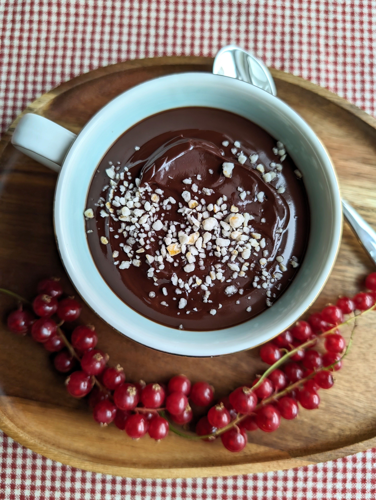

# Karštas šokoladas

Sveikiname visus su šv. Kalėdomis! Linkime jums jaukių, įsimintinų švenčių, malonių ir šiltų akimirkų su šeima ir artimaisiais. 😊
Tikime, kad jūsų šventiniai stalai pripildyti įvairiausiais augaliniais patiekalais, tačiau jei iki pilnos laimės truktų tik kažko saldaus, dalinamės nesudėtingai paruošiamu karštu šokoladu, kuris tikime, jūsų šventėms suteiks dar daugiau jaukumo. 😊

## Jums reikės (2 porcijos)

* 100 g juodojo šokolado
* 240 ml riebaus kokosų pieno (24% riebumo)
* 1 a.š. cukraus pudros
* Riešutų arba cukruotų apelsinų žievelių gabalėliai (nebūtina, naudojama papuošimui)

## Paruošimas

1. Ištirpiname nedideliame inde juodąjį šokoladą ir supilame kokosų pieną. Įberiame cukraus pudros ir išmaišome. Viską kartu keletą minučių pakaitiname maišant.
2. Patiekiame nedideliuose puodeliuose, paviršių pabarstant riešutų arba cukruotų apelsinų žievelių gabalėliais.

Skanių ir linksmų švenčių!

