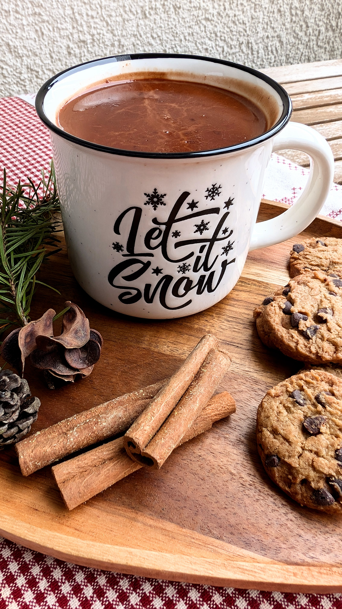

# Kakava su šokoladu ir cinamonu

Sveikiname su šv. Kalėdomis! 

Linkime Jums jaukių ir įsimintinų švenčių, šiltų akimirkų su šeima ir artimaisiais. Augalingais patiekalais apkrautų šventinių stalų ir džiugesio, juoko jūsų namuose. 😊

Tikimės, kad kasdien versdami Advento Kalendoriaus langelius nesunkiai pasiruošėte šventėms, nepritrūkote įkvėpimo ir idėjų savo virtuvėje. 😊

Kviečiame šį Kalėdų rytą pasitikti su puodeliu garuojančios, karštos kakavos pagardintos šokoladu ir cinamonu. 

## Jums reikės (2 porcijoms)

* 500 ml augalinio pieno Barista
* 60 g kepinių šokolado
* 1 a.š. kakavos
* 1 a.š. rudojo cukraus
* 1 a.š. cinamono
* žiupsnelio druskos

## Paruošimas

1. Nedideliame puode išlydome šokoladą su šlakeliu augalinio pieno, šildant ant mažos kaitros.
2. Supilame likusį augalinį pieną. Maišydami pakaitiname pieną.
3. Maišydami ruošiamą gėrimą, per sietelį beriame cinamoną ir kakavą, kad nesusidarytų gumulėliai. 
4. Suberiame cukrų ir įdedame žiupsnelį druskos. Maišant švelniai paverdame kakavą. 
5. Ir mėgaujamės!

Ačiū labai, kad Kalėdų laukėte kartu su mumis kasdien versdami šio Advento kalendoriaus langelius. 

Taip pat atskiras padėkas siunčiu visiems, kurie šiemet atsidėkodami ir norėdami paremti mūsų ateities augalinius projektus, nusprendėte paremti mus [Ko-Fi sistemoje ir "pavaišinote mus kava"](https://ko-fi.com/post/Dekojame-uz-palaikyma-ir-dovanojame-receptu-rinkin-X8X616TLBE#checkoutModal). Dėkojame už visus gražius žodžius, padėkas ir skatinimą kurti toliau! AČIŪ!!! :)

Linkime jums smagių švenčių ir laimingų, artėjančių Naujųjų metų. Būkit sveiki ir laimingi!

