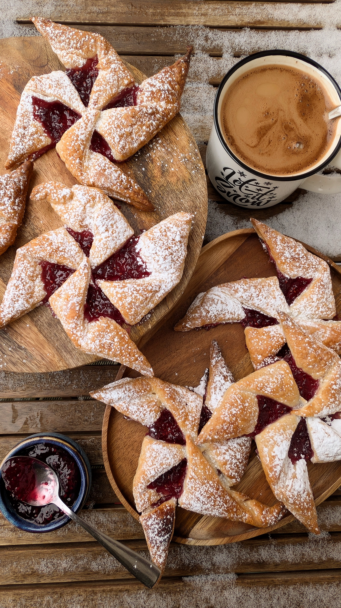

# Joulutorttu su slyvų džemu (Suomija)

Sveikiname su šv. Kalėdomis! Linkime jums laimės, sveikatos ir neblėstančios energijos. Daug šypsenų, pozityvumo ir juoko. Ramybės, taikos ir šviesių artėjančių Naujųjų metų. Tegul pildosi jūsų svajonės, o jus supa gėris, ir kiekviename gyvenimo žingsnyje lydi sėkmė. :) 

Nuoširdžiai dėkojame, kad šiemet laukėte švenčių kartu su mumis versdami Advento kalendoriaus langelius. Tikimės, kad mūsų Advento kalendorius padėjo ne tik rasti naujų idėjų šventiniam stalui, bet ir visą mėnesį kūrė šventinę nuotaiką, bei supažindino su kitų šalių papročiais, o gal net įnešė naujų tradicijų ir į jūsų namus. :)

Ačiū, kad skaitėte, dalinotės su kitais ir išbandėte mūsų naujus receptus. Ypatingai dėkojame visiems, kas rado laiko ne tik skaityti, bet ir parašyti mums ar net paremti mūsų augalinius projektus. AČIŪ!!! <3 <3 <3 

Neįtikėta, bet mūsų 25 dienas trukusi kalėdinė skonių kelionė po Pasaulį šiandien pasiekė paskutinę stotelę. Kalėdų dieną trumpam užsukime į Suomiją, kur sutikti tikrąjį Santą Klausą (suomiškai *Joulupukki*) yra patys didžiausi šansai! :) Juk būtent čia, Laplandijoje, yra įsikūrusi oficiali Kalėdų senelio rezidencija. Tačiau Suomijos Kalėdų laikotarpis sukasi tikrai ne tik apie tai. :) 

Suomijoje Kalėdos švenčiamos ramiai ir jaukiai, laikantis senųjų, iš kartos į kartą perduodamų, tradicijų. Šventiniu laikotarpiu sulėtinamas gyvenimo tempas ir pagrindinis dėmesys skiriamas buvimui su artimiausiais žmonėmis. 

Atėjus Gruodžiui namų languose nušvinta tiltelių su žvakėmis šviesos, o suomiai renkasi bažnyčiose ne tik pasiklausyti, bet ir giedoti Kalėdines giesmes. Per visą šalį nuvilnija šventinio sezono pradžią skelbiantys renginiai (*Christmas opening events*) ir miestų pagrindinėse aikštėse pradeda veikti šurmulingos, atmosferiškos Kalėdų mugės. Rovaniemyje (oficialiame Santa Klauso miestelyje) Kalėdų sezonas atidaromas su šventiniu koncertu, šventės kulminacija tampa Santa Klauso kalba, po kurios įprastai prasideda siautulinga elfų diskoteka.

Kaip ir kitose Skandinavijos šalyse, Suomijoje reikšmingiausia Kalėdinio laikotarpio diena yra Kūčios (*Jouluaatto*). Kūčių rytą pusryčiams įprasta valgyti ryžių pudingą su sviestu, cukrumi ir cinamonu, kuriame būtinai paslepiamas vienas migdolas. Jį radusiam žmogui dovanojama maža dovanėlė ir tikima, kad jį lydės sėkmė. Iš ryto per televiziją rodoma speciali ir visų vaikų ypatingai mėgstama laida - *Santa’s Hot Line*, kurios metu vaikai gali paskambinti ir pasikalbėti su Kalėdų seneliu. O vidurdienį transliuojamas istorinis "Kalėdų ramybės paskelbimas" iš seniausio Suomijos miesto Turku, oficialiai pradedantis šventinio sezono pradžią ir skatinantis šiuo laikotarpiu būti pagarbiais ir taikiais. Per Kūčias suomiai prisimena ir savo mirusius artimus žmones, lanko jų kapus ir uždega žvakes.

Nors pasiruošimo darbų ir skubėjimo Kūčių dieną tikrai netrūksta, tačiau suomiai, nebūtų suomiai, jei per Kūčias nerastų laiko saunai. Apsilankymas saunoje su visa šeima Kūčių rytą arba dienos metu yra svarbi ir turbūt viena seniausių suomiškų tradicijų. Tai trumpa pauzė prieš šventes atsipalaiduoti, pailsėti, išsivalyti mintis ir savo kūną, *nuplauti* praėjusių metų sunkumus ir rūpesčius. Šventinėje Kalėdų saunoje svarbu neskubėti ir pasimėgauti ramybe. Ypatinga atmosfera kuriama su degančiomis žvakėmis ir žibintais, bei kvapniais saunos aliejais. Po saunos šeima susirenka šventinės Kūčių vakarienės, po kurios būtina nunešti vaišių ir saunos elfui (*saunatonttu*). Tikima, kad kiekviena sauna turi savo elfą, kurį privaloma gerbti ir juo rūpintis. 

Suomių Kalėdų stalo pagrindinis patiekalas yra keptas kumpis su garstyčiomis, patiekiamas su įvairių šakninių daržovių (bulvių, morkų, ropių) troškiniais, burokėlių salotomis. Na, o desertui kepami imbieriniai sausainiai (*piparkakut*) ir žvaigždės formos, sluoksniuotos tešlos pyragėliai *Joulutorttu* su slyvų džemu. Tradicinis suomių Kalėdų gėrimas yra prieskoningas *glögi*, kuris verdamas su raudonuoju vynu arba tamsių uogų sultimis, pagardinamas cinamonu, kardamonu, gvazdikėliais ir įprastai patiekiamas su razinomis, migdolais.

* 2 vnt. sluoksniuotos tešlos
* 250 g džemo (tradiciškai gaminama su slyvų džemu, tačiau šiame recepte naudojome miško uogų džemą)
* Cukraus pudros
* Aliejaus kepimui

## Paruošimas

1. Įkaitiname orkaitę iki 220°C temperatūros.
2. Išvyniojame pirktinę, sluoksniuotą tešlą ir pjaunant peiliu ją padaliname į lygias šešias dalis. Gausis 6 kvadratėliai iš vieno tešlos lakšto. Tą patį padarome su kitu tešlos lakštu. 
3. Nuo kiekvieno tešlos kvadratėlio kampo įstrižai centro link padaromi keturi įpjovimai. Centre paliekame pakankamai vietos džemui patepti. Tešlos kvadratėlyje įpjovus juosteles nuo kiekvieno kampo link centro bus matomi 4 trikampiai, kurie jungiasi centre tarpusavyje.
4. Kiekvieno tešlos kvadratėlio viduryje dedame po maždaug šaukštą uogienės ir užlenkiame po vieną susiformavusio trikampio kampą link centro. Užlenktus kampelius šiek tiek paspaudžiame, kad susiklijuotų ir laikytųsi.
5. Patepame bandeles trupučiu aliejaus ir kepame orkaitėje ~15 min. 
6. Pyragėliams atvėsus juos pabarstome cukraus pudra. 

Linkime jums smagių švenčių ir laimingų, artėjančių Naujųjų metų. Būkit sveiki ir laimingi! :)

