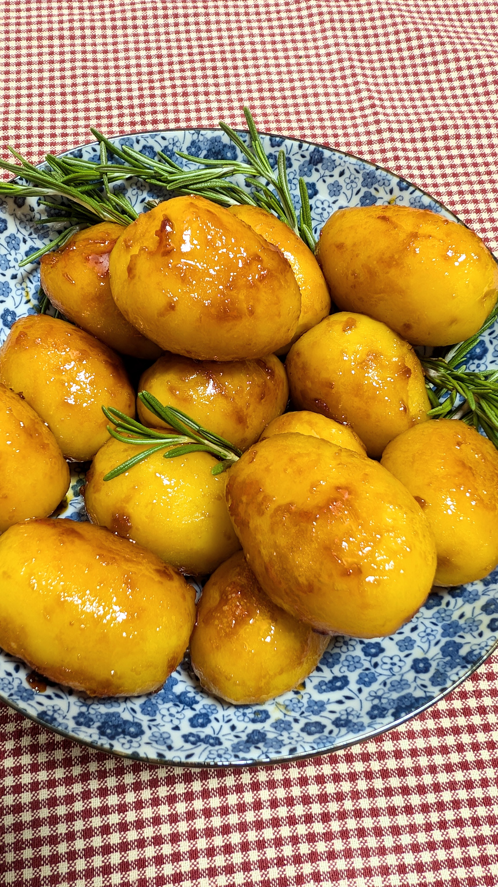

# Karamelizuotos bulvės (Danija)

Daugelis danų Kalėdų (*Jul*) laukia versdami advento kalendoriaus (*julekalender*) langelius su saldainiais ar smulkiomis dovanėlėmis, o pusryčių metu kasdien uždegdami žvakę su 24 dienas reiškiančiais žymėjimais. 

Kalėdų eglutės dažnai puošiamos namuose gamintais žaisliukais - popierinėmis širdelėmis (*julehjerte*), Danijos vėliavėlėmis, šiaudiniais žaisliukais. Iki šiol daugelis danų šeimų eglutes puošia tikromis žvakėmis, kas suteikia Skandinavišką *hygge* atmosferos pojūtį (*Hygge* – daniškas žodis, reiškiantis jaukumo, jaukiai leidžiamo laiko, paprastų malonumų ir ramybės atmosferą. Šis žodis talpina paprastus džiaugsmus, kaip karštas gėrimas, jaukūs pledai, ramus laikas kartu su mylimais žmonėmis be skubėjimo, tai ir žvakių šviesa ir šiltas apšvietimas, židinio spragsėjimas už lango lėtai krentant snaigėms. Pajutote? :) Visa tai ir daugiau telpa viename daniškame žodyje.)

Pagrindinė šventė vyksta Gruodžio 24 dieną, Kalėdų išvakarėse, kai vakarienės susirenka visa šeima. Švenčiama su daug maisto, kuriam paruošti įprastai prireikia kelių dienų. Tradicinis stalas neįsivaizduojamas be karamelizuotų bulvių garnyro (vadinamo *brunede kartofler*) ir ryžių pudingo su vyšnių padažu (*Risalamande*) desertui. 

Danijos išskirtinė Kalėdų tradicija - po Kūčių vakarienės visai šeimai susikibus rankomis šokti aplinkui Kalėdų eglutę dainuojant Kalėdines dainas. Tą patį vakarą apsikeičiama ir dovanomis. Dovanas Danijoje neša *Julemanden* (Kalėdų žmogus, verčiant pažodžiui) kartu su savo išdykusiais padejėjais *Nisse* (labai panašūs į Amerikiečių elf-on-a-shelf).

## Jums reikės

* 600 g nedidelių ar vidutinio dydžio bulvių 
* 100 g cukraus
* 50 g augalinio sviesto 
* Druskos

## Paruošimas

1. Bulvės nuplaunamos ir verdamos su lupenomis pasūdytame vandenyje. Išvirus bulves, vanduo nupilamas ir jos užpilamos šaltu vandeniu, kad atvėstų. Galima išvirti iš vakaro, kadangi karamelizavimui naudojamos pilnai atvėsintos bulvės.
2. Atvėsusias bulves nulupame.
3. Į sausą keptuvę dedame cukraus ir lėtai kaitiname, nemaišant, kol jis ištirpsta ir šiek tiek paruduoja. Tuomet dedame augalinį sviestą.
4. Kai augalinis sviestas ištirpsta ir pradeda tarsi putoti, tuomet sudedame į keptuvę atvėsintas, nuluptas bulves ir jas karamelizuojame ant vidutinės kaitros apie 10 min, atsargiai vis apverčiant, kad tolygiai pasidengtų ir paruduotų.
5. Karamelizuotos bulvės patiekiamos Kalėdų vakarienei karštos.

Jei norėtumėte palinkėti linksmų Kalėdų daniškai, sakykite - God Jul! :)
