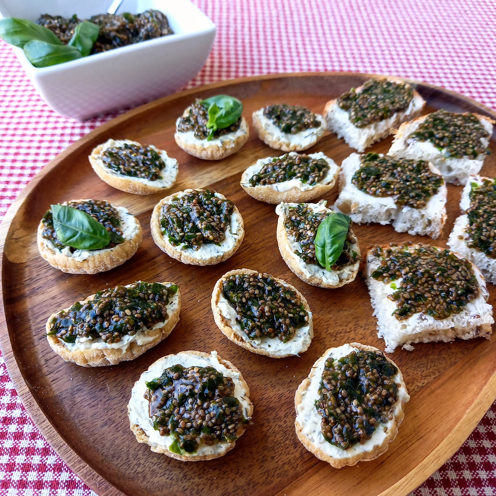

# Sumuštinukai su augaliniais chia&nbsp;"ikrais"

Ar žinojote, kad atkurti ikrų skonį, pasitelkiant tik augalinius produktus, nėra sudėtinga? 
Dalinuosi labai paprastu, nesudėtingai paruošiamu receptu, kuris tikrai nustebins ir jus, ir jūsų svečius. Chia "ikrai" puikiai tinka ruošti vieno kąsnio užkandžius, be to labai skaniai tinka ir tiesiog valgyti su augaliniu sviestu patepta šviesios duonos riekele. Todėl prie paruošimo aprašymo dalinuosi dviem mano mėgstamais augalinių "ikrų" panaudojimo būdais.
Pažadu, kad sumuštinukų skonis, kaip ir su tikrais ikrais, bus prabangus, šventiškas ir originalus!

## Jums reikės

* 3 v.š. chia sėklų
* 3 v.š. smulkintų nori lapų
* 2 v.š. sojos padažo
* 100 ml vandens
* Šlakelio šviežiai įspaustų citrinos sulčių
* Žiupsnelio druskos
* Forminės duonos arba mėgstamų duonos trapučių/traškučių (aš naudojau avižų duonos trapučius)
* Augalinio sviesto arba augalinės, baltos užtepėlės su žolelėmis (aš naudojau avižų užtepėlę su krapais)

## Paruošimas

1. Chia sėklas sumaišome su smulkintais nori lapais, sojos padažu. Įpilame vandens, įspaudžiame kelis lašus citrinos sulčių ir įdedame nedidelį žiupsnelį druskos. Viską gerai išmaišome. 
2. Brinkiname chia sėklas apie 2-3 val. šaldytuve, uždarytame indelyje. 
3. Gaminame sumuštinukus:
   a) Forminę duoną papjaustome gabalėliais, tolygiai patepame augaliniu sviestu ir dedame šaukštelį augalinių "ikrų". 
   b) Tepame augalinę avižų užtepėlę ant avižų duonos trapučio ir dedame šaukštelį chia "ikrų". Jei norisi, sumuštinuką galima papuošti baziliko lapeliu.

   Skanaus ir lengvo pasiruošimo šventėms! :)

