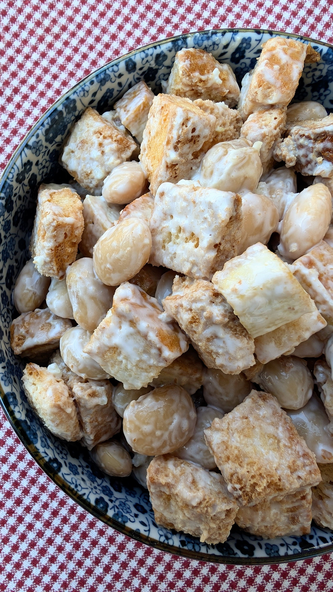

# Sviestinių pupelių, tofu ir keptos duonos mišrainė

Jei ši mišrainė dar iki šiol nebuvo įtraukta į jūsų šventinio stalo meniu, tai ženklas pagaliau ją šiemet išbandyti. :) 

Kuo ji man taip patinka? Lengva ir greita pagaminti, mažai pjaustyti, o skonis tiesiog puikus. :)

## Jums reikės

* 1 skardinės sviestinių pupelių
* 1 pakelio tofu (~200 g)
* ~ 5 vnt. forminės duonos riekelių
* 2 vnt. česnako skiltelių
* Žiupsnelio druskos
* Veganiško majonezo
* Aliejaus kepimui

## Paruošimas

1. Kubeliais supjaustome duoną ir skrudiname orkaitėje, įkaitintoje iki 180°C temperatūros, kol duona taps sausa ir traški. Duoną galite rinktis juodą arba šviesią pagal jūsų skonį. 😊
2. Keptuvėje apkepame kubeliais supjaustytą tofu. Apkepame kantriai vartant, kad apkeptų ir apskrustų visos tofu kubelio pusės.
3. Dubenyje sumaišome skrudintą duoną, keptus tofu kubelius, konservuotas sviestines pupeles. Įspaudžiame dvi skilteles česnako, įberiame žiupsnelį druskos. Mišrainę su majonezu permaišome prieš pat patiekiant ant stalo.  

   Skanaus ir lengvo pasiruošimo šventėms! :)

