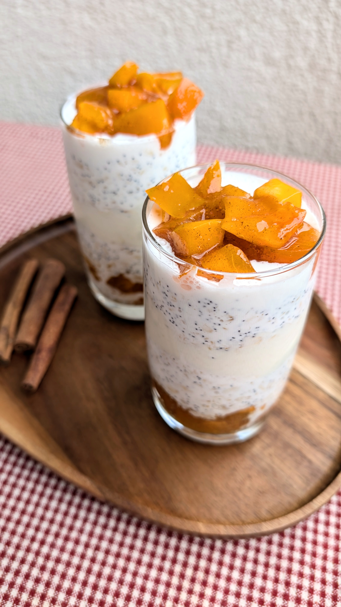

# Kalėdomis kvepiantys pusryčiai: per naktį brinkintos avižos su aguonomis ir persimonais

Visi žinome, kad skanūs ir maistingi pusryčiai garantuoja gerą nuotaiką visai dienai, tad verta pasistengti! Klevų sirupo saldumas, aguonų traškumas, cinamono aromatas ir apesinų uogienės rūgštelė kartu su sezoniniais persimonais tikrai privers jus pajusti Kalėdinę dvasią. :)

## Jums reikės (dviems porcijoms)

* 120 g avižų 
* 250 ml kokosų pieno
* 2 v.š. aguonų 
* Žiupsnelio druskos
* 2 v.š. klevų sirupo
* ~4 v.š. natūralaus skonio augalinio jogurto 
* 2 a.š. apelsinų uogienės 
* 2 vnt. persimonų
* Trupučio cinamono (apie 1/4 a.š.)

## Paruošimas

1. Nuplauname 120 g avižų ir užpilame kokosų pienu. Įdedame žiupsnelį druskos, įberiame aguonų ir įpilame šaukštą klevų sirupo. Viską išmaišome ir paliekame brinkti per naktį šaldytuve, uždarytame indelyje.
2. Jogurtą sumaišome su apelsinų uogiene tokiu santykiu: 4 v.š. jogurto ir 2 a.š. apelsinų uogienės.
3. Persimonus papjaustome smulkiais kubeliais, užpilame 1 v.š. klevų sirupo ir pabarstome cinamonu. Viską išmaišome.
4. Ruošiame avižinę košę patiekimui dedami sudedamąsias dalis sluoksniais į aukštą stiklinę. Dedame sluoksnį persimonų (pagardintų klevų sirupu ir cinamonu), ant viršaus - sluoksnis per naktį brinkintų avižų, toliau - jogurtas su apelsinų uogiene, dar vienas sluoksnis brinkintų avižų, o paviršiuje dedame persimonų gabalėlius sumaišytus su klevų sirupu ir cinamonu.

   Skanių ir jaukių, lėtų pusryčių! :)

