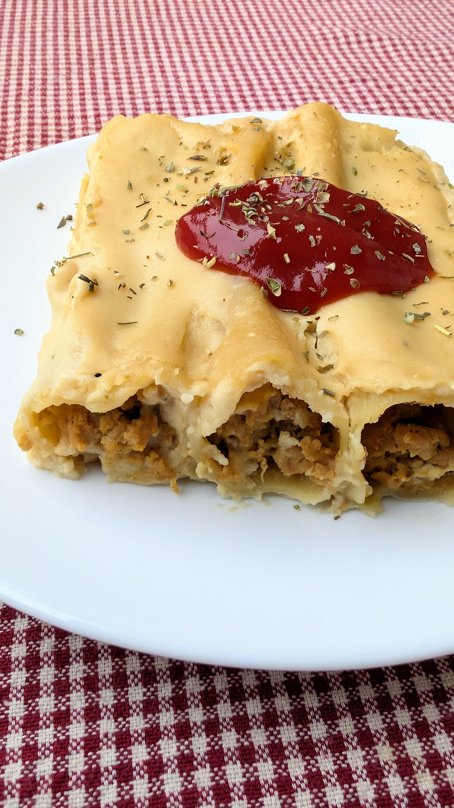

# Canelons de Sant Esteve (Ispanija)

Ispanijoje pagrindinė šventinė vakarienė valgoma Kalėdų išvakarėse (*Nochebuena*), prieš vidurnakčio mišias bažnyčioje. Pagal vieną iš senųjų ispanų tradicijų, po vidurnakčio mišių ispanai eina gatvėmis su deglais, grodami gitaromis ir tamburinais, bei būgnais. Ispanijoje sakoma: "*Esta noche es Noche-Buena, Y no Es noche de dormir*", kas reiškia "Šiandien yra gera naktis ir ji nėra skirta miegoti".

Ispanai namus Kalėdoms dekoruoja šiek tiek kitaip nei mums įprasta. Namuose Kalėdiniu laikotarpiu eglutė nėra tokia svarbi, tuo tarpu daug daugiau reikšmės suteikiama prakartėlei vaizduojančiai Jėzaus gimimą. Prakartėlės varijuoja nuo mažų iki detalių su Trimis Karaliais, piemenimis ir gyvūnais, ir net...atokiau pastatyta, humoristine besituštinančio vyruko figurėle. :D Ši figūrėlė, kad ir kaip juokingai skambėtų, simbolizuoja gausą ir derlingumą naujiems metams, o tuo pačiu žmogiškumą (net šventųjų scenose žmonės paprasti ir žemiški).

Per Kalėdas (*Navidad*) vaikai gauna dovanėlių, tačiau pagrindinės dovanos nešamos Sausio 6 d., per Tris Karalius (*Fiesta de Los tres Reyes Magos*; iš ispanų kalbos reiškia "Trijų Magiškų Karalių šventė"). Vaikai rašo laiškus ne Kalėdų Seneliui, o Trims Karaliams, ir prašo norimų dovanų, o Sausio 5 d., Trijų Karalių šventės išvakarėse, palieka savo batus ant palangių, balkonuose ir po eglute dovanoms sudėti. Vaikai taip pat palieka dovanų ir Trims Karaliams: graikinių riešutų ar net po stiklinę konjako kiekvienam. Dažnai paliekamas ir kibiras vandens kupranugariams atsigerti. Tuo tarpu Ispanijos miestuose Sausio 5 d. vyksta įspūdingi paradai vaizduojantys Trijų Karalių atvykimą. 

Gruodžio 28 dieną Ispanijoje švenčiamas Melagių dienos atitikmuo, visi juokauja ir bando iškrėsti pokštą, apgauti, tad būkite budrūs, jei šią dieną lankysitės Ispanijoje. :) 

Na, o per Naujus metus (*Nochevieja*), laikrodžiui mušant 12 valandą ispanai su kiekvienu laikrodžio dūžiu valgo 12 vynuogių. Kiekviena jų simbolizuoja mėnesius ir sėkmę, bei klestėjimą Naujais metais. 

Šiandienos receptas - *Canelons de Sant Esteve*, į lietuvių kalba verstųsi kaip Šventojo Stepono kanelonai. Tai tradicinis kataloniškas patiekalas, valgomas Gruodžio 26 d. – Šv. Stepono dieną. Paprastai gaminamas iš Kalėdų vaišių likučių: įprastai iš mėsos, kuri vėl sumalama ir naudojama kaip įdaras kanelonams (vamzdelio formos makaronams). Veganiškoje recepto versijoje makaronų viduje sojos faršas. Kepama orkaitėje gausiai apliejus Bešamelio padažu. Taip pat prieš kepant galima patiekalo paviršių pabarstyti ir augaliniu sūriu.

## Jums reikės 

* 1 l sojos pieno (nesaldinto)
* 500 ml vandens
* 300 g sojos faršo 
* 1 vnt. daržovių sultinio kubelio
* 2 vnt. svogūnų
* 3 vnt. česnako skiltelių
* Aliejaus kepimui 
* 250 ml riebaus kokosų pieno
* 250 g Canneloni makaronų
* 1 a. š. rūkytos paprikos 
* 0,5 a. š. saldžiosios paprikos 
* 0,5 a. š. ciberžolės 
* 1/3 a. š. garstyčių miltelių 
* 1 a. š. vištienos prieskonių mišinio (be druskos)
* Druskos ir juodųjų pipirų pagal skonį 
* Čiobrelių

## Bešamelio padažui reikės 

* 110 g augalinio sviesto
* 1200 g augalinio pieno
* 8 v. š. miltų

## Paruošimo eiga

1. Į puodą pilame 1 litrą augalinio sojos pieno ir 500 ml vandens. Suberiame sofos faršą. Įdedame kubelį daržovių sultinio. Išmaišome ir verdame ant nedidelės kaitros 10 min (arba kaip nurodo instrukcija ant sojos faršo pakuotės). Virimo pabaigoje didžiąją dalį skysčių turėtų būti sugėręs sojos faršas, jei visgi būtų per daug skysta, tuomet nupilkite vandenį naudojant koštuvą 
2. Į keptuvę įpilame šiek tiek aliejaus ir apkepame susmulkintus svogūnus. Jiems suminkštėjus, įspaudžiame česnako skilteles ir pakepame maišant dar apie minutę. 
3. Į keptuvę sudedame išvirtą sojos faršą, apkepame keletą minučių. Tuomet dedame prieskonius, įpilame kokosų pieno ir viską vis pamaišant patroškiname. 
4. Orkaitę įkaitiname iki 180°C temperatūros.
5. Pasiruoštą įdarą dedame šaukšteliu į makaronų vamzdelius. 
6. Pasiruošiame Bešamelio padažą. Puode ištirpiname sviestą ir po truputį į jį suberiame, bei išmaišome miltus. Tuomet maišant pilame augalinį pieną. Kaitiname maišant, kol padažas pradeda tirštėti ir įgauna norimą konsistenciją.
7. Į orkaitėje kepti pritaikytą indą įpilame ir tolygiai ant dugno paskirstome Bešamelio padažą. Ant jo dėliojame įdarytus makaronų vamzdelius ir jų paviršių užpilame Bešamelio padažu. Jei norima galima pabarstyti augaliniu sūriu. Kepame orkaitėje apie 30-40 min.(Įsiminkite kokia kryptimi sudėjote makaronų vamzdelius, kad iškepus būtų patogiau pjaustyti).

Skanaus!

P.S. Jei savo šventiniam Kalėdų stalui ieškote daugiau idėjų, kviečiame parsisiųsti mūsų sukurtą šventinį "Valgyk daugiau daržovių" žurnalo leidinį, kuriame net 32 receptai, patarimai šventinio stalo dekorui, valgomų dovanų idėjos, veganiškų desertų paslaptys ir dar daug visko. Leidinys prieinamas visiems mūsų veiklos remėjams. :) 

