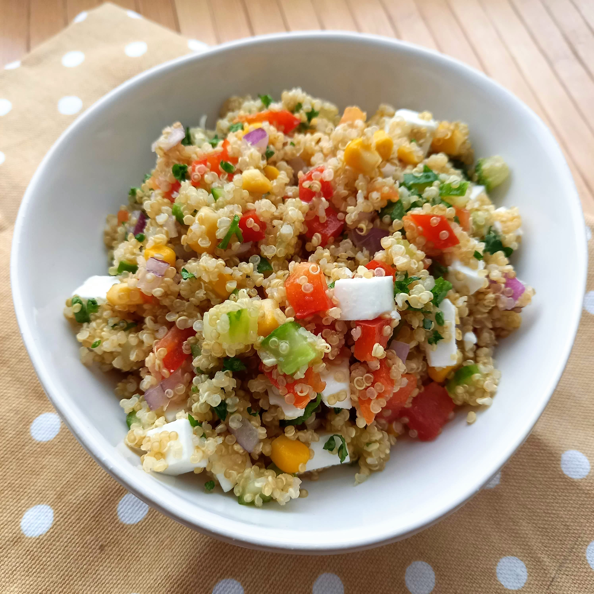

# Bolivinės balandos salotos su&nbsp;veganiška&nbsp;"feta"

Gaivios ir lengvos, bet tuo pačiu sočios ir maistingos, bolivinės balandos salotos su veganiška "feta".
Spalvingas, puikiai tarpusavyje derančių ingredientų derinys tikrai vertas atsidurti ant jūsų šventinio stalo. 

## Jums reikės

* 200 g bolivinės balandos
* 0,5 saldžiosios paprikos
* 0,5 raudonojo svogūno
* 0,5 ilgavaisio agurko
* 2 v.š. alyvuogių aliejaus
* 200 g veganiškos fetos alternatyvos
* 140 g konservuotų kukurūzų
* 0,5 citrinos
* Šviežių petražolių
* Žiupsnelio druskos ir juodųjų pipirų

## Paruošimo eiga

1. Išverdame 200 g bolivinės balandos. Bolivinę balandą sumaišome su alyvuogių aliejumi ir atvėsiname atskirame inde.
2. Smulkiai supjaustome daržoves ir petražoles. Veganišką fetą supjaustome kubeliais.
3. Daržoves apjungiame inde su atvesinta bolivine balanda ir veganiška feta. Įdedame žiupsnelį druskos ir juodųjų pipirų, įspaudžiame šviežių citrinos sulčių (naudojame pusę citrinos arba pagal skonį). Viską išmaišome.

Skanaus!

