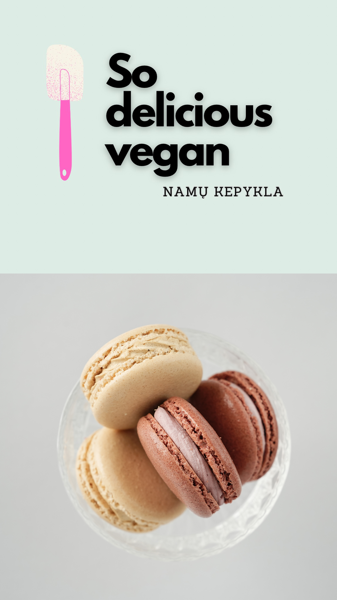

# Šventinis, saldus pasiūlymas

"So delicious vegan" namų kepyklėlė garsėja gaminamais augalinės sudėties ir aukštos kokybės, įvairiausių skonių macarons desertais. Šokoladiniai, lazdyno riešutų, braškių, mango ir specialiai Kalėdoms sukurtas asortimentas su Gingerbread latte ir Kalėdinio vyno skoniais.

Šiemet "So delicious vegan" turi jums specialų šventinį pasiūlymą. Tad pasilepinkit save, užsisakykite išskirtinių desertų savo šventiniam Kalėdų stalui ir pasirūpinkit saldžiomis dovanomis savo draugams, kolegoms ir artimiesiems. :)

Su nuolaidos kodu: Macarons10, macarons asortimentui bus taikoma 10% nuolaida (nuolaidos kodą nurodykite pateikiant užsakymą žinute Facebooke ar Instagram platformose). Nuolaidos kodas galioja iki 2024-12-23 d.

P.S. Šiuos macarons esame ragavę patys! Nuoširdžiai, skanesnių niekur neteko ragauti. Labiausiai sužavėjo, kad jų skonis natūralus ir ne per saldus. Tad rekomenduojam nedvejojant užsisakyti. :)

Skanaus šventinio laukimo ir lengvo pasiruošimo šventėms!

