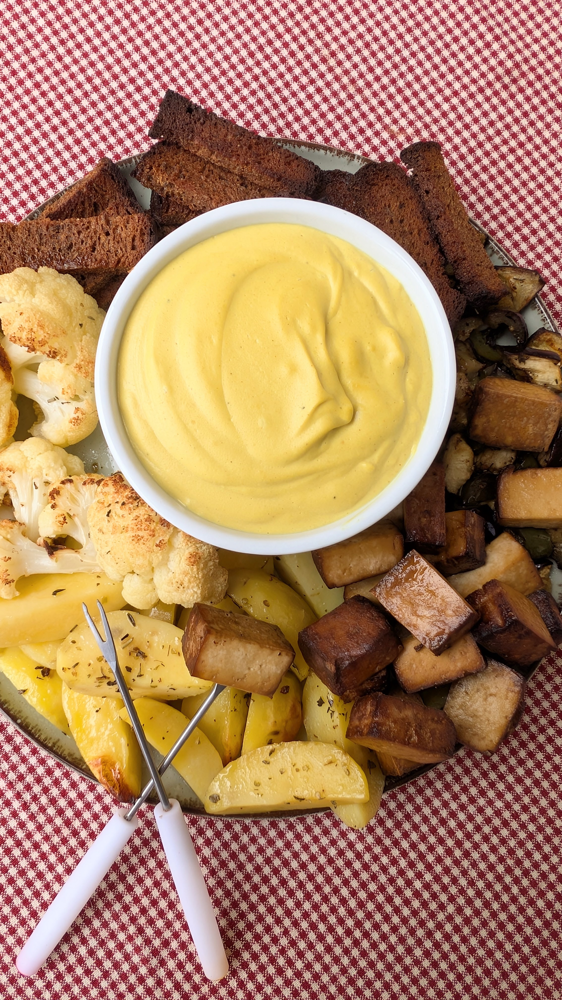

# Fondiu (Šveicarija)

Šveicarijoje Kalėdų senelis (vietinių vadinamas *Samichlaus*) apsilanko Gruodžio 6 dieną, tai žymi Kalėdinio sezono pradžią. *Samichlaus* atvyksta ne iš tolimo Šiaurės ašigalio, bet iš šalia esančio miško, ir tikrai ne su skraidančiais elniais, o su asiliuku. *Samichlaus* atvyksta ne vienas. Kartu su juo pasirodo ir jo paslaptingas, tylus palydovas *Schmutzli* (apsirengęs juodai, slepiantis veidą po gubtuvu) ir "baudžiantis" blogai besielgusius vaikus, tam jis su savimi net turi šluotą iš šakelių. *Samichlaus* dalina vaikams mandarinus, riešutus ir šokoladukus, bet pagrindinė tradicinė dovana yra *grittibänz* - mažas duonos žmogeliukas. 

Šveicarijoje papuošta Kalėdinė eglutė dažnai yra slepiama ir parodoma tik po Kūčių vakarienės. Ant eglutės uždegamos tikros žvakės, dainuojamos kalėdinės dainos ir keičiamasi dovanomis. Kūčių ir Kalėdų šventiniai patiekalai varijuoja tarp skirtingų regionų, tačiau ypač mėgstamas yra fondiu. Per Kūčias pagrindiniu, bendru patiekalu dažnai būna *Fondue Chinoisen* (Kinų fondiu) - plonais gabaliukais supjaustyta mėsa verdama bendrame puode su sultiniu. Interneto forumuose šveicarai dalinosi, kad šeimos veganams ir vegetarams dažnai būna paruošiamas atskiras fondiu puodas su daržovių sultiniu, kuriame apverdamos įvairios daržovės. Tuo tarpu per Kalėdas populiarumo netrūksta sūrio fondiu. Lydytas sūris maišomas su baltu vynu, prieskoniais ir česnaku, o į jį mirkomi duonos kubeliai.

Nors internete gausu idėjų, kaip pasiruošti veganišką sūrio fondiu naudojant įvairias augalines sūrio alternatyvas, visgi siūlau pasigaminti šiek tiek maistingesnę versiją iš pupelių ir anakardžių, į kurią puikiai tinka mirkyti orkaitėje keptas dažoves (bulves, žiedinius kopūstus, baklažanus), keptą duoną ir rūkyto tofu kubelius. O išbandę šį fondiu patys, įsitikinome, kad šis patiekalas tikrai magiškai apjungia prie stalo kartu valgančius žmones. :)

## Jums reikės

* 130 g anakardžių
* 350 g sojos pieno
* 1 skardinės sviestinių pupelių
* 1 v. š. alyvuogių aliejaus 
* 1 v. š. baltojo vyno arba obuolių acto
* 3 v. š. maistinių mielių
* 1 v. š. kukurūzų krakmolo 
* 4 vnt. česnako skiltelių 
* 1 a. š. ciberžolės
* 0,5 a. š. Dijon garstyčių 
* 1,5 v. š. sezamo pastos Tahini
* Druskos ir trupučio juodųjų pipirų

## Paruošimas

1. Anakardžius nuplauname ir užpilame kartu, užvirintu vandeniu. Palaikome apie 20-30 min., kad suminkštėtų. Po mirkymo vandenį nupilame.
2. Į virtuvinį mikserį sudedame visus ingredientus ir sutriname iki vientisos, kreminės konsistencijos. Pagal individualų skonį įdedame druskos ir pipirų.
3. Perpilame į priekaistuvį ir šiek tiek pašildome maišant. Fondiu turėtų gautis pakankamai tirštas, tad jei jums gautųsi skystokas, pakaitinkite šiek tiek ilgiau, kad sutirštėtų.
4. Perpilkite į fondiu indą su apačioje uždegta žvakute ir patiekite su karštomis, orkaitėje keptomis daržovėmis, tofu kubeliais bei kepta duona.

Skanaus!